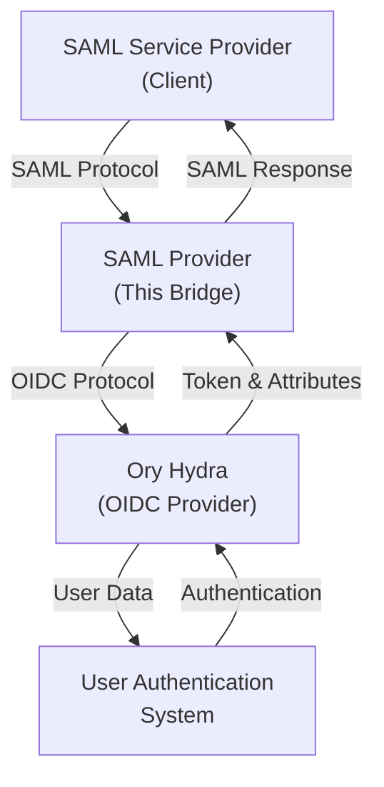

# Identity SAML Provider

A complete SAML-to-OIDC bridge solution that enables SAML-based Single Sign-On (SSO) through Ory Hydra, allowing seamless integration between SAML Service Providers and OIDC providers.

## Project Overview

This project provides a SAML Identity Provider that bridges between traditional SAML Service Providers and modern OIDC-based authentication systems. It consists of two main components:

- **SAML Provider** - The primary service in this repository that handles SAML authentication requests and translates them to OIDC flows
- **Example SAML Service** - A sample service that demonstrates user authentication and attribute handling

## Architecture



## Quick Start

### Running Locally with Docker Compose

#### Set up

To use an OIDC provider like GitHub or Google with Ory Kratos, you will need to set the appropriate environment variables

A `.env` file is recommended for this purpose. Commonly used variables include:

```bash
KRATOS_OIDC_PROVIDER_CLIENT_ID=my-client-id
KRATOS_OIDC_PROVIDER_CLIENT_SECRET=my-client-secret
```

#### Run the Environment

1. **Run the supporting services** (generates certs and starts the supporting services):

   ```bash
   make docker
   ```

2. **Run the SAML provider**:

   Then, run the identity-saml-provider:

   ```bash
   make run
   ```

3. **Register the example SAML service**:

   In another terminal, register the example SAML service with the SAML provider, and then run it.

   ```bash
   cd test/saml-service
   make register
   make run
   ```


4. **Access the services**:

   In a browser, access the Example SAML Service: <https://localhost:8083/hello>

5. **Shut down supporting services**:

   To stop all running services, use:

   ```bash
   make down
   ```

### Running with Skaffold

#### Prerequisites

-   **Kubernetes Cluster**: `microk8s` (recommended) or any K8s cluster.
    -   Enable addons: `sudo microk8s enable dns hostpath-storage registry`
-   **Skaffold**: [Install Skaffold](https://skaffold.dev/docs/install/) (if not using `snap` or included tools).
-   **Kustomize**: Required for generating manifests (Skaffold usually handles this).
-   **Make**: To generate certificates.

#### Setup

First, ensure your kubernetes configuration is available at the default location (`~/.kube/config`). If you are using `microk8s`, you can generate this file with:

```bash
mkdir -p ~/.kube && microk8s config > ~/.kube/config
```

Next, generate the required certificates for the environment:

```bash
make k8s-certs
```

This will create the necessary certificates in `k8s/certs` for the SAML provider.

Create or edit `k8s/secrets/kratos.env` and add your OIDC provider credentials (for Ory Kratos) in the following `key=value` format (or, if these values are already set in your root `.env` file, run `make k8s-copy-secrets` to generate/update `k8s/secrets/kratos.env` automatically):

```bash
client-id=your-kratos-oidc-client-id
client-secret=your-kratos-oidc-client-secret
```

Finally, redirect the host `hydra` to localhost in your `/etc/hosts` file:

```text
127.0.0.1 hydra
```

This is necessary for Ory Hydra to function correctly in the local environment, because the container needs to use the same address / hostname as your browser. There's probably a better way to accomplish this, but this is the simplest for now.

#### Run

To start the development environment with Skaffold using your microk8s OCI registry, run:

```bash
skaffold dev --default-repo=localhost:32000 --cache-artifacts=false
```

## Configuration

### Environment Variables and Kratos OIDC Configuration

See the [`config.go`](internal/provider/config.go) file for configuration options specific to the SAML provider, which can all be set via environment variables.

## License

See the [LICENSE](LICENSE) file for details.
