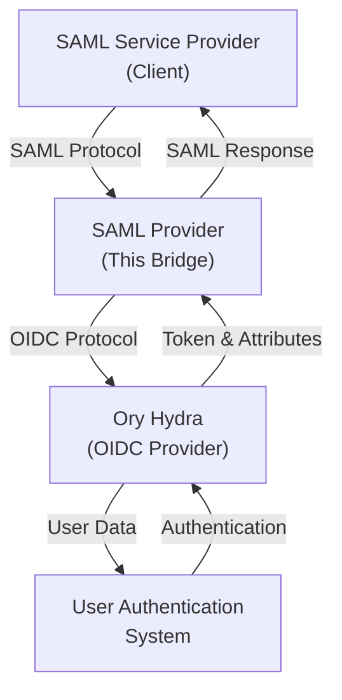

# Identity SAML Provider

A complete SAML-to-OIDC bridge solution that enables SAML-based Single Sign-On (SSO) through Ory Hydra, allowing seamless integration between SAML Service Providers and OIDC providers.

## Project Overview

This project provides a SAML Identity Provider that bridges between traditional SAML Service Providers and modern OIDC-based authentication systems. It consists of two main components:

- **SAML Provider** - Acts as a SAML Identity Provider that handles SAML authentication requests and translates them to OIDC flows
- **Service** - A sample identity service that demonstrates user authentication and attribute handling

## Architecture



## Key Components

```text
.
├── provider/              # SAML-to-OIDC bridge service (the main piece here)
├── service/               # Identity service (sample implementation of SAML client for testing)
├── docker/                # Docker configurations
├── bin/                   # Compiled binaries
├── docker-compose.yml     # Full stack composition
├── docker-compose.dev.yml # Development configuration
└── Makefile               # Root-level build orchestration
```

## Quick Start

### Running Locally

1. **Run the supporting services** (generates certs and starts the supporting services):

   ```bash
   make dev
   ```

2. **Run the SAML service**:

   Then, run the saml-service:

   ```bash
   make run-service
   ```

3. **Run the SAML provider**:

   In another terminal, run the saml-provider:

   ```bash
   make run-provider
   ```

4. **Access the services**:

   In a browser, access the SAML Service (Client): <https://localhost:8083/hello>

5. **Shut down supporting services**:

   To stop all running services, use:

   ```bash
   make down
   ```

## Configuration

### Environment Variables and Kratos OIDC Configuration

For `saml-provider` specific configuration, see [provider/README.md](provider/README.md#configuration).

To use an OIDC provider like GitHub or Google with Ory Kratos, you will need to set the appropriate environment variables. There are several other variables you may need to set depending on your setup. Check the docker compose files for reference.

A `.env` file is recommended for this purpose. Commonly used variables include:

```bash
KRATOS_OIDC_PROVIDER_CLIENT_ID=my-client-id
KRATOS_OIDC_PROVIDER_CLIENT_SECRET=my-client-secret
```

### Configure for complete Docker Compose setup

Add the following entries to your `/etc/hosts` file for local testing:

```text
127.0.0.1 hydra
```

This is necessary for Ory Hydra to function correctly in the local environment, because the container needs to use the same address / hostname as your browser. There's probably a better way to accomplish this, but this is the simplest for now.

You will also need to modify the Ory Kratos configuration file in `docker/kratos/kratos.yml` to set the issuer URL to `http://hydra:4444/` instead of `http://localhost:4444/`.

## License

See the [LICENSE](LICENSE) file for details.
