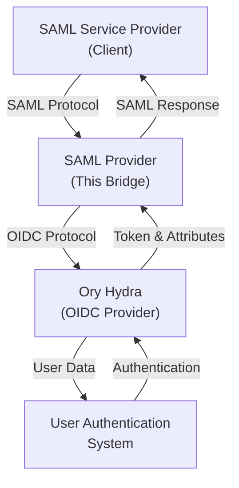

# Identity SAML Provider

A complete SAML-to-OIDC bridge solution that enables SAML-based Single Sign-On (SSO) through Ory Hydra, allowing seamless integration between SAML Service Providers and OIDC providers.

## Project Overview

This project provides a SAML Identity Provider that bridges between traditional SAML Service Providers and modern OIDC-based authentication systems. It consists of two main components:

- **SAML Provider** - Acts as a SAML Identity Provider that handles SAML authentication requests and translates them to OIDC flows
- **Service** - A sample identity service that demonstrates user authentication and attribute handling

## Architecture



## Key Components

```text
.
├── provider/              # SAML-to-OIDC bridge service (the main piece here)
├── service/               # Identity service (sample implementation of SAML client for testing)
├── docker/                # Docker configurations
├── bin/                   # Compiled binaries
├── docker-compose.yml     # Full stack composition
├── docker-compose.dev.yml # Development configuration
└── Makefile               # Root-level build orchestration
```

## Quick Start

### Running Locally

1. **Generate certificates** for both provider and service:

   ```bash
   make certs
   ```

2. **Run in development mode** (generates certs and starts both services):

   ```bash
   make dev
   ```

   Or run individual services:

   ```bash
   make run-provider  # Run SAML provider
   make run-service   # Run identity service
   ```

### Running with Docker Compose

```bash
docker-compose up -d --build
```

## Configuration

### Configure hosts file

Add the following entries to your `/etc/hosts` file for local testing:

```text
127.0.0.1 hydra
```

This is necessary for Ory Hydra to function correctly in the local environment, because the container needs to use the same address / hostname as your browser. There's probably a better way to accomplish this, but this is the simplest for now.

### Building

```bash
make build
```

### Running Tests

Refer to individual service READMEs for testing instructions.

### Cleaning Up

Remove all build artifacts and certificates:

```bash
make clean
```

## Documentation

- [SAML Provider Documentation](provider/README.md)
- [Ory Hydra Documentation](https://www.ory.sh/hydra/docs/)
- [Ory Kratos Documentation](https://www.ory.sh/kratos/docs/)

## License

See the [LICENSE](LICENSE) file for details.
