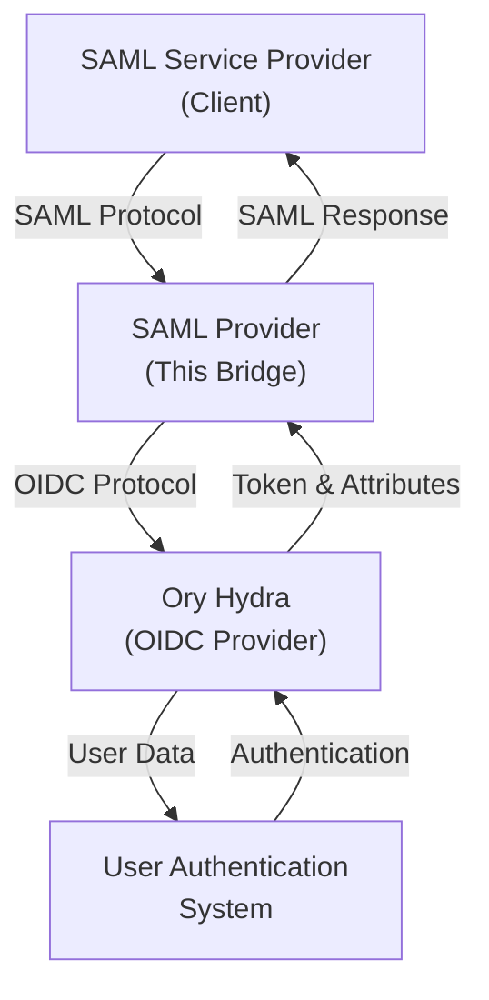

# Identity SAML Provider

[](https://github.com/canonical/identity-saml-provider/blob/main/LICENSE)
[](https://github.com/pre-commit/pre-commit)
[](https://conventionalcommits.org)

A complete SAML-to-OIDC bridge solution that enables
SAML-based Single Sign-On (SSO) through Ory Hydra, allowing
seamless integration between SAML Service Providers and
OIDC providers.

## Project Overview

This project provides a SAML Identity Provider that bridges
between traditional SAML Service Providers and modern
OIDC-based authentication systems. It consists of two main
components:

- **SAML Provider** - The primary service in this repository
  that handles SAML authentication requests and translates
  them to OIDC flows
- **Example SAML Service** - A sample service that
  demonstrates user authentication and attribute handling

## Architecture


```mermaid
graph TD
    A["SAML Service Provider<br/>(Client)"]
    B["SAML Provider<br/>(This Bridge)"]
    C["Ory Hydra<br/>(OIDC Provider)"]
    D["User Authentication<br/>System"]

    A -->|SAML Protocol| B
    B -->|OIDC Protocol| C
    C -->|User Data| D
    D -->|Authentication| C
    C -->|Token & Attributes| B
    B -->|SAML Response| A
```

## Quick Start

### Running Locally with Docker Compose

#### Set up

To use an OIDC provider like GitHub or Google with
Ory Kratos, you will need to set the appropriate
environment variables.

A `.env` file is recommended for this purpose. Commonly
used variables include:

```bash
KRATOS_OIDC_PROVIDER_CLIENT_ID=my-client-id
KRATOS_OIDC_PROVIDER_CLIENT_SECRET=my-client-secret
```

#### Run the Environment

1. **Run the supporting services** (generates certs and starts the supporting services):

   ```bash
   make docker
   ```

2. **Run the SAML provider**:

   Then, run the identity-saml-provider:

   ```bash
   make run
   ```

3. **Register the example SAML service**:

   In another terminal, register the example SAML service
   with the SAML provider, and then run it.

   ```bash
   cd test/saml-service
   make register
   make run
   ```

4. **Access the services**:

   In a browser, access the Example SAML Service: <https://localhost:8083/hello>

5. **Shut down supporting services**:

   To stop all running services, use:

   ```bash
   make dev-down
   ```

### Running with Skaffold

#### Prerequisites

- **Kubernetes Cluster**: `microk8s` (recommended) or any K8s cluster.
  - Enable addons: `sudo microk8s enable dns hostpath-storage registry`
- **Skaffold**:
  [Install Skaffold](https://skaffold.dev/docs/install/)
  (if not using `snap` or included tools).
- **Kustomize**: Required for generating manifests (Skaffold usually handles this).
- **Make**: To generate certificates.

#### Setup

First, ensure your kubernetes configuration is available
at the default location (`~/.kube/config`). If you are
using `microk8s`, you can generate this file with:

```bash
mkdir -p ~/.kube && microk8s config > ~/.kube/config
```

Next, generate the required certificates for the environment:

```bash
make k8s-certs
```

This will create the necessary certificates in
`k8s/certs` for the SAML provider.

Create or edit `k8s/secrets/kratos.env` and add your OIDC
provider credentials (for Ory Kratos) in the following
`key=value` format (or, if these values are already set in
your root `.env` file, run `make k8s-secrets` to
generate/update `k8s/secrets/kratos.env` automatically):

```bash
client-id=your-kratos-oidc-client-id
client-secret=your-kratos-oidc-client-secret
```

Finally, redirect the host `hydra` to localhost in your `/etc/hosts` file:

```text
127.0.0.1 hydra
```

This is necessary for Ory Hydra to function correctly in
the local environment, because the container needs to use
the same address / hostname as your browser. There's
probably a better way to accomplish this, but this is the
simplest for now.

#### Run

To start the development environment with Skaffold using
your microk8s OCI registry, run:

```bash
skaffold dev --default-repo=localhost:32000 --cache-artifacts=false
```

## Configuration

### Environment Variables and Kratos OIDC Configuration

See the [`config.go`](internal/app/config.go) file
for configuration options specific to the SAML provider,
which can all be set via environment variables.

For local or non-production environments with custom or
self-signed certificate chains, set
`SAML_PROVIDER_HYDRA_CA_CERT_PATH` to a PEM file containing
the trusted CA certificate used by Hydra.

As a last resort for local testing only, you can set
`SAML_PROVIDER_HYDRA_INSECURE_SKIP_TLS_VERIFY=true` to
disable TLS certificate verification for outbound Hydra
OIDC requests.

### Tracing Sampler Configuration

Tracing sampling is configurable and defaults to a
production-safe parent-based ratio sampler instead of
sampling every request.

To enable tracing, set:

- `SAML_PROVIDER_TRACING_ENABLED=true`

To export traces to an OTLP collector, set one of these endpoint variables:

- `SAML_PROVIDER_OTEL_GRPC_ENDPOINT` for OTLP/gRPC (example: `localhost:4317`)
- `SAML_PROVIDER_OTEL_HTTP_ENDPOINT` for OTLP/HTTP (example: `localhost:4318`)

Endpoint selection behavior:

- If `SAML_PROVIDER_OTEL_GRPC_ENDPOINT` is set, OTLP/gRPC is used.
- Otherwise, if `SAML_PROVIDER_OTEL_HTTP_ENDPOINT` is set, OTLP/HTTP is used.
- If neither endpoint is set, traces are written to stdout.

- `SAML_PROVIDER_OTEL_SAMPLER` (default: `parentbased_traceidratio`)
- `SAML_PROVIDER_OTEL_SAMPLER_RATIO` (default: `0.1`)

Supported sampler values for `SAML_PROVIDER_OTEL_SAMPLER`:

| Value | Description |
| ----- | ----------- |
| `parentbased_traceidratio` / `parentbased` | **(default)** Child spans follow the parent's sampling decision. New root traces are sampled at `SAML_PROVIDER_OTEL_SAMPLER_RATIO`. |
| `traceidratio` | Samples every trace (root and child) independently at `SAML_PROVIDER_OTEL_SAMPLER_RATIO`, ignoring the parent decision. |
| `always_on` | Samples every request. Not recommended for production due to high overhead. |
| `always_off` | Never samples. Useful for disabling tracing output without disabling the tracer. |

With the default configuration, new root traces are sampled
at a ratio of `SAML_PROVIDER_OTEL_SAMPLER_RATIO`, and child
spans follow the parent sampling decision.

### Connecting to an External Identity Provider

See the [Connecting to an External Identity Provider](docs/external-idp.md)
guide for instructions on how to connect your local
deployment to an external IDP such as one of the Prodstack
IAM instances.

### Service Provider Management CLI

The `identity-saml-provider sp` command group manages SAML
service provider registrations, including per-SP
attribute mapping configuration.

#### Registering a Service Provider

```bash
identity-saml-provider sp add \
  --entity-id <entity-id> \
  --acs-url <acs-url> \
  [--acs-binding <binding>] \
  [--attribute-mapping-file <path-to-json>] \
  [--nameid-format <format>] \
  [--format text|json]
```

| Flag | Description | Default |
| ---- | ----------- | ------- |
| `--entity-id`, `-e` | Entity ID of the service provider (required, must be a valid URL) | — |
| `--acs-url`, `-a` | Assertion Consumer Service URL (required, must be a valid URL) | — |
| `--acs-binding`, `-b` | ACS binding type | `urn:oasis:names:tc:SAML:2.0:bindings:HTTP-POST` |
| `--attribute-mapping-file` | Path to a JSON file containing the attribute mapping configuration | — |
| `--nameid-format` | NameID format (e.g., `persistent`, `transient`, `emailAddress`) | — |
| `--format`, `-f` | Output format: `text` or `json` | `text` |

The command connects directly to the database using
`SAML_PROVIDER_DB_*` environment variables (same as the
server). No running server is required.

#### Attribute Mapping File

The attribute mapping file is a JSON configuration that
controls how OIDC claims from the identity provider are
mapped to SAML attributes for a specific service provider.
All claims from the OIDC ID token are available for
mapping.

**Example `mapping.json`:**

```json
{
  "nameid_format": "persistent",
  "saml_attributes": {
    "subject": "uid",
    "email": "mail",
    "name": "cn",
    "groups": "memberOf",
    "username": "preferredUsername"
  },
  "oidc_claims": {
    "sub": "subject",
    "email": "email",
    "name": "name",
    "groups": "groups",
    "preferred_username": "username"
  },
  "options": {
    "lowercase_email": true
  }
}
```

**Fields:**

| Field | Description |
| ----- | ----------- |
| `nameid_format` | SAML NameID format. Accepted values: `persistent`, `transient`, `emailAddress`, `unspecified`, or a full URN. Defaults to `transient`. |
| `oidc_claims` | Maps OIDC claim names (from the ID token) to internal field names. Any claim present in the OIDC ID token can be mapped. |
| `saml_attributes` | Maps internal field names to SAML attribute names sent to the service provider. |
| `options.lowercase_email` | When `true`, lowercases the email attribute value before mapping. |

The mapping works in two stages:

1. **OIDC → Internal**: `oidc_claims` maps token claim names to internal field names
2. **Internal → SAML**: `saml_attributes` maps internal
   field names to SAML attribute names

**Example usage:**

```bash
# Register with a full attribute mapping file
identity-saml-provider sp add \
  --entity-id https://myapp.example.com \
  --acs-url https://myapp.example.com/saml/acs \
  --attribute-mapping-file mapping.json

# Register with only a NameID format override
identity-saml-provider sp add \
  --entity-id https://myapp.example.com \
  --acs-url https://myapp.example.com/saml/acs \
  --nameid-format persistent
```

## License

See the [LICENSE](LICENSE) file for details.
