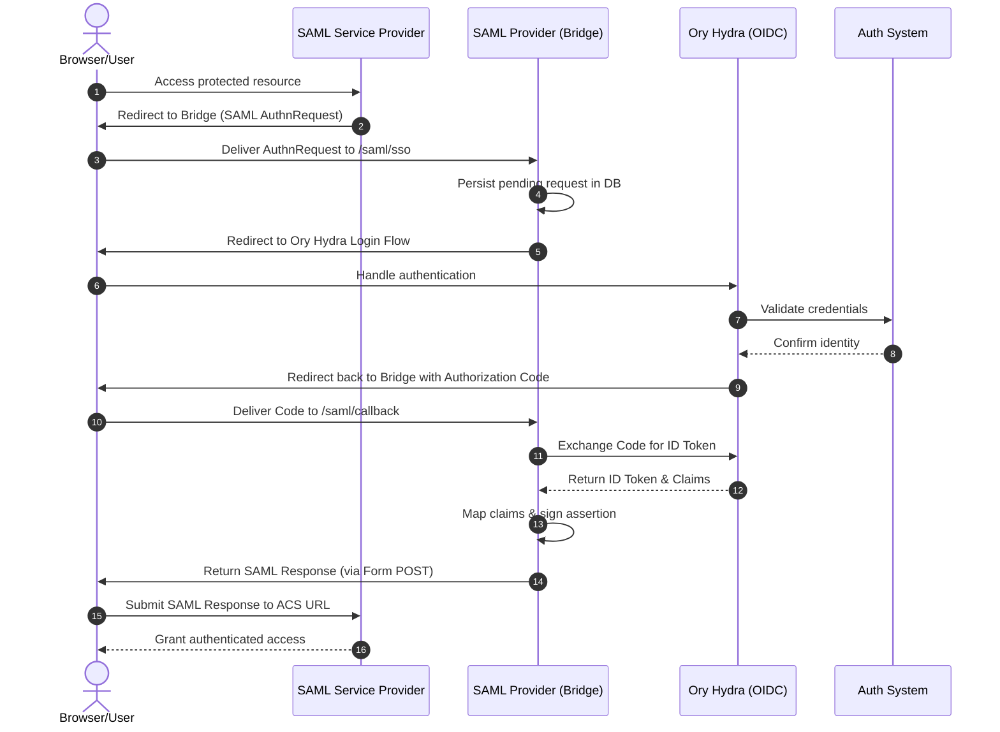

# Identity SAML Provider

[](https://github.com/canonical/identity-saml-provider/blob/main/LICENSE)
[](https://github.com/pre-commit/pre-commit)
[](https://conventionalcommits.org)

The Identity SAML Provider is a high-performance **SAML-to-OIDC bridge** that
enables SAML 2.0 Single Sign-On (SSO) through Ory Hydra. This service acts as
an intermediary, translating legacy SAML 2.0 requests into modern OpenID Connect
(OIDC) flows.

---

## Project Overview

The bridge translates incoming SAML authentication requests, delegates
authentication to an OIDC provider via Ory Hydra, and maps the resulting OIDC
claims into secure, signed SAML assertions.

The repository contains two components:

- **SAML Provider**: The core bridge service handling protocol translation,
  session validation, and attribute mappings.
- **Example SAML Service (`test/example-sp`)**: A reference Service Provider
  (SP) for development, local testing, and attribute verification.

---

## Key Features & Capabilities

- **SAML 2.0 Compliance**: Supports the SAML 2.0 Web Browser SSO Profile with
  both `HTTP-POST` and `HTTP-Redirect` bindings.
- **Flexible Attribute Mapping**: Features a two-stage pipeline converting OIDC
  ID token claims into standard SAML attributes.
- **Configurable NameIDs**: Supports `persistent`, `transient`, `emailAddress`,
  and `unspecified` NameID formats.
- **Operational Observability**:
  - OpenTelemetry (OTel) tracing with configurable parent-based ratio sampling.
  - Native Prometheus metrics exposing database pool stats, application request
    counters, and latencies.
- **Production-Grade Security**: Validates OIDC state and nonce attributes,
  signs SAML responses, and supports secure session cookie configurations.

---

## Architecture

The following diagram illustrates the interaction between components during a
SAML login flow:


```mermaid
sequenceDiagram
    autonumber
    actor User as Browser/User
    participant SP as SAML Service Provider
    participant Bridge as SAML Provider (Bridge)
    participant Hydra as Ory Hydra (OIDC)
    participant Auth as Auth System

    User->>SP: Access protected resource
    SP->>User: Redirect to Bridge (SAML AuthnRequest)
    User->>Bridge: Deliver AuthnRequest to /saml/sso
    Bridge->>Bridge: Persist pending request in DB
    Bridge->>User: Redirect to Ory Hydra Login Flow
    User->>Hydra: Handle authentication
    Hydra->>Auth: Validate credentials
    Auth-->>Hydra: Confirm identity
    Hydra->>User: Redirect back to Bridge with Authorization Code
    User->>Bridge: Deliver Code to /saml/callback
    Bridge->>Hydra: Exchange Code for ID Token
    Hydra-->>Bridge: Return ID Token & Claims
    Bridge->>Bridge: Map claims & sign assertion
    Bridge->>User: Return SAML Response (via Form POST)
    User->>SP: Submit SAML Response to ACS URL
    SP-->>User: Grant authenticated access
```

---

## Quick Start

### 1. Local Development via Docker Compose

This configuration provisions Ory Hydra, Ory Kratos, PostgreSQL, and
MailSlurper to simulate a complete identity ecosystem.

#### Configure Local Environment

Create a `.env` file in the project root containing the OIDC client credentials
used by Ory Kratos:

```bash
KRATOS_OIDC_PROVIDER_CLIENT_ID=your-provider-client-id
KRATOS_OIDC_PROVIDER_CLIENT_SECRET=your-provider-client-secret
```

#### Start Supporting Services

Run the following command to generate local development TLS certificates and
launch background containers:

```bash
make dev
```

#### Start the SAML Provider

Run the SAML bridge service:

```bash
make run
```

#### Run and Register the Example SP

In a separate terminal, register the test service provider with the database
and start the example application:

```bash
cd test/example-sp
make register
make run
```

#### Verify the Flow

1. Navigate the browser to the Example SP dashboard:
   [http://localhost:8083/hello](http://localhost:8083/hello).
2. Follow the flow to complete the SAML login process.

#### Tear Down

```bash
make dev-down
```

---

### 2. Local Kubernetes via Skaffold

Skaffold enables continuous local development and deployment to a Kubernetes
cluster (such as `microk8s`).

#### Prerequisites

- **Kubernetes Cluster**: `microk8s` with DNS, storage, and registry addons
  enabled:

  ```bash
  sudo microk8s enable dns hostpath-storage registry
  ```

- **Skaffold**: Installed locally ([Skaffold Installation Guide](https://skaffold.dev/docs/install/)).
- **Configuration**: Expose the Kubeconfig context:

  ```bash
  mkdir -p ~/.kube && microk8s config > ~/.kube/config
  ```

#### Deployment Steps

1. Generate the required Kubernetes certificates:

   ```bash
   make k8s-certs
   ```

2. Generate Kubernetes secrets from root `.env` variables:

   ```bash
   make k8s-secrets
   ```

3. Map `hydra` to localhost in the host's `/etc/hosts` file:

   ```text
   127.0.0.1 hydra
   ```

4. Build and deploy the services in development mode:

   ```bash
   skaffold dev --default-repo=localhost:32000 --cache-artifacts=false
   ```

---

## Configuration

Application settings are configured via environment variables prefixed with
`SAML_PROVIDER_`.

The complete schema, including available environment variables, validation
rules, and default values, is defined in [internal/app/config.go](internal/app/config.go).

---

## SAML Service Provider Integration

Establishing trust and registering Service Providers (SPs) with the bridge
requires metadata exchange and registration.

### 1. Metadata Trust Exchange

To configure a SAML Service Provider to trust this bridge, configure the SP to
fetch the Identity Provider (IdP) metadata XML from:

```text
http://<bridge-host-address>/saml/metadata
```

### 2. Service Provider Registration (CLI)

Service providers are registered directly in the database using the `service-provider`
command group:

```bash
identity-saml-provider service-provider create \
  --entity-id <entity-id> \
  --acs-url <acs-url> \
  [--acs-binding <binding>] \
  [--attribute-mapping-file <path-to-json>] \
  [--format text|json]
```

| Flag                       | Description                                                                       |
|:---------------------------|:----------------------------------------------------------------------------------|
| `--entity-id`              | Unique URI identifying the Service Provider (Required).                           |
| `--acs-url`                | Assertion Consumer Service URL on the SP side (Required).                         |
| `--acs-binding`            | SAML binding style. Defaults to `urn:oasis:names:tc:SAML:2.0:bindings:HTTP-POST`. |
| `--attribute-mapping-file` | Path to JSON mapping rules.                                                       |
| `--format`                 | Output format (`text` or `json`, default: `text`).                                |

---

### 3. Attribute & Claims Mapping Flow

The bridge translates identity claims via a two-stage mapping architecture:

```text
[ OIDC ID Token Claims ]
           │
           ▼  (Stage 1: oidc_claim_mappings)
   [ Internal Fields ]
           │
           ▼  (Stage 2: saml_attribute_mappings)
[ Signed SAML Assertions ]
```

#### Mapping Specification Schema (`mapping.json`)

```json
{
  "nameid_format": "persistent",
  "saml_attribute_mappings": {
    "subject": { "name": "uid" },
    "email": {
      "name": "urn:oid:0.9.2342.19200300.100.1.3",
      "friendly_name": "mail"
    },
    "name": { "name": "cn" },
    "groups": { "name": "memberOf" }
  },
  "oidc_claim_mappings": {
    "sub": "subject",
    "email": "email",
    "name": "name",
    "groups": "groups"
  },
  "options": {
    "lowercase_email": true
  }
}
```

- `nameid_format`: Formats the subject identifier. Supported: `persistent`,
  `transient`, `emailAddress`, `unspecified`, or custom URN. Defaults to
  `transient`.
- `oidc_claim_mappings`: Direct key-value conversion from OIDC ID Token claim
  names to internal fields.
- `saml_attribute_mappings`: Maps internal fields to SAML assertion attributes.
- `options.lowercase_email`: When set to `true`, normalizes email value strings
  to lowercase.

---

### 4. Admin HTTP API

As an alternative to CLI actions, Service Providers and their mappings can be
managed dynamically via a RESTful Admin API:

| Method   | Route                                        | Parameter                    | Request Body    | Purpose                                    |
|:---------|:---------------------------------------------|:-----------------------------|:----------------|:-------------------------------------------|
| `POST`   | `/admin/service-providers`                   | —                            | SP JSON Payload | Registers a new SP.                        |
| `GET`    | `/admin/service-providers`                   | `entity_id=<url-encoded-id>` | —               | Retrieves SP configurations.               |
| `PUT`    | `/admin/service-providers/attribute-mapping` | `entity_id=<url-encoded-id>` | JSON Mapping    | Sets or replaces mapping rules.            |
| `DELETE` | `/admin/service-providers/attribute-mapping` | `entity_id=<url-encoded-id>` | —               | Deletes mapping rules (resets to default). |

#### Examples

```bash
# Setup environment variables
ENTITY_ID=$(printf 'https://myapp.example.com' | jq -sRr @uri)
BASE_URL="http://localhost:8082/admin/service-providers"

# Fetch registration details
curl "${BASE_URL}?entity_id=${ENTITY_ID}"

# Set mapping rules from a file
curl -X PUT -H "Content-Type: application/json" \
  "${BASE_URL}/attribute-mapping?entity_id=${ENTITY_ID}" \
  --data-binary @mapping.json

# Reset mapping to default (writes NULL to DB)
curl -X DELETE "${BASE_URL}/attribute-mapping?entity_id=${ENTITY_ID}"
```

- **Empty Map (`PUT {}`)**: Sets an explicit, empty mapping object. Subsequent
  calls return `"attribute_mapping": {}`.
- **Delete Map (`DELETE`)**: Removes mapping configuration rules. Subsequent
  calls omit the `attribute_mapping` key.

---

## Development & Contribution

Refer to [CONTRIBUTING.md](CONTRIBUTING.md) for detailed guidelines on the
contribution workflow, code generation, commit conventions, and running the code
verification suite.

---

## License

This project is licensed under the terms of the **GNU Affero General Public
License v3.0**. Read [LICENSE](LICENSE) for the full details.
