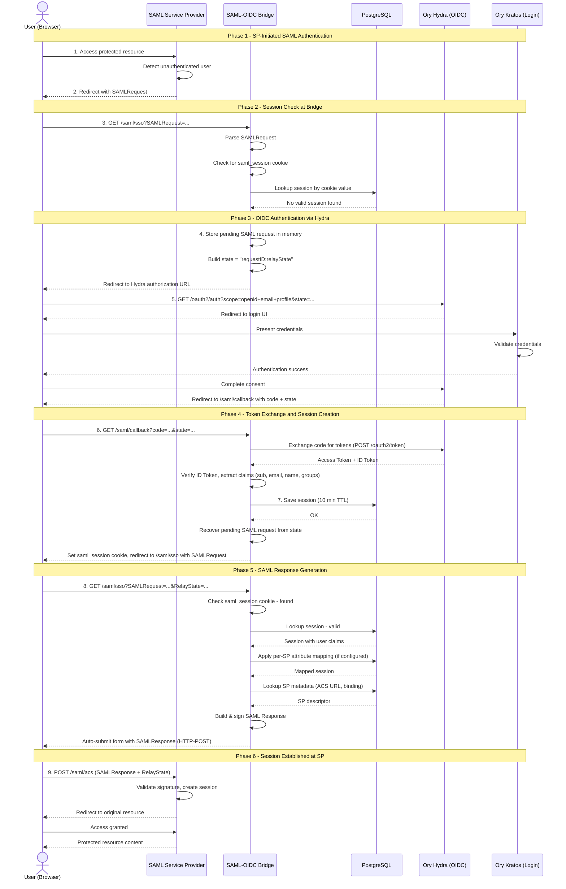
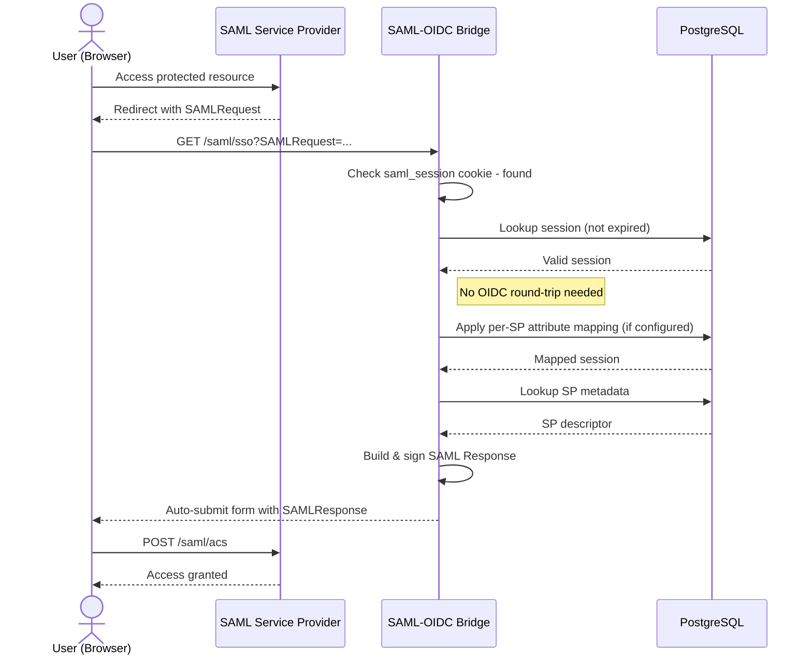

# Authentication Flow — Identity SAML Provider

## Overview

The Identity SAML Provider acts as a **SAML Identity
Provider (IdP)** that bridges SAML authentication requests
to an **OpenID Connect (OIDC)** provider (Ory Hydra). This
allows legacy SAML Service Providers to authenticate users
through modern OIDC infrastructure without modification.

## Components

| Component | Role |
| --------- | ---- |
| **SAML Service Provider (SP)** | Application that requires user authentication (e.g., GitLab) |
| **SAML-OIDC Bridge** | This service — translates SAML requests into OIDC flows |
| **Ory Hydra** | OIDC Provider that manages OAuth2/OIDC authorization |
| **Ory Kratos** | Identity management backend (handles actual login UI and credentials) |
| **PostgreSQL** | Stores sessions, registered service provider metadata, and per-SP attribute mappings |

## Authentication Flow (Step-by-Step)

### 1. User Accesses Protected Resource

The user navigates to a protected resource on the SAML
Service Provider.

### 2. SP Generates SAML AuthnRequest

The SP detects the user is unauthenticated and generates
a **SAML AuthnRequest**. It redirects the user's browser
to the bridge's SSO endpoint (`/saml/sso`) via
HTTP-Redirect or HTTP-POST binding, including a
`SAMLRequest` parameter and optional `RelayState`.

### 3. Bridge Receives AuthnRequest and Checks Session

The bridge parses the SAML AuthnRequest and checks for an
existing session by looking for a `saml_session` cookie.
If the cookie is present, the bridge retrieves the
corresponding session from PostgreSQL and validates it
hasn't expired. If a valid session exists,
**skip to step 8**.

### 4. Store Pending Request & Redirect to Hydra

If no valid session exists:

- The original SAML request data (request ID, encoded
  `SAMLRequest`, and `RelayState`) is stored in memory
  as a pending request
- The bridge constructs an OAuth2 `state` parameter
  encoding the SAML request ID and optional RelayState
  (format: `"requestID"` or `"requestID:relayState"`)
- The user is redirected to **Ory Hydra's authorization
  endpoint** with OIDC scopes `openid`, `email`,
  `profile`

### 5. User Authenticates with Hydra/Kratos

Hydra presents the login flow (typically delegated to Ory
Kratos for credential verification). The user enters
their credentials and authenticates. After successful
authentication, Hydra redirects the user back to the
bridge's callback URL (`/saml/callback`) with an
**authorization code** and the original `state` parameter.

### 6. Bridge Exchanges Code for Tokens

The bridge's OIDC callback handler:

1. **Exchanges** the authorization code for an OAuth2
   token (including an ID token) via Hydra's token
   endpoint
2. **Verifies** the ID token signature and claims
3. **Extracts** user claims: `sub` (subject identifier),
   `email`, `name`, `groups`, plus all raw claims for
   per-SP attribute mapping

### 7. Create SAML Session and Redirect Back

The bridge creates a session from the OIDC claims:

1. Creates a session with the user's email as default
   `NameID`, display name, subject identifier, group
   memberships, and all raw OIDC claims (for per-SP
   mapping). The session has a **10-minute TTL**.
2. Persists the session to **PostgreSQL**
3. Sets a `saml_session` HTTP cookie on the user's
   browser
4. Recovers the original SAML request from the pending
   request store using the `state` parameter (the
   pending request is consumed and deleted on retrieval)
5. Redirects the user back to `/saml/sso` with the
   original `SAMLRequest` and `RelayState`

### 8. Bridge Generates SAML Response

On the second pass through `/saml/sso` (or on the first
pass if a valid session already existed), the bridge:

1. Retrieves the valid session from PostgreSQL
2. **Applies per-SP attribute mapping** if the SP has a
   mapping configured — this can customize the NameID
   format, map OIDC claims to custom SAML attribute
   names, and apply transforms (e.g., lowercase email).
   If no mapping is configured, default attributes are
   used.
3. Looks up the SP's metadata (Entity ID, ACS URL,
   binding) from PostgreSQL
4. Builds a **signed SAML Response** containing a SAML
   Assertion with the user's attributes (NameID,
   standard attributes, and any custom attributes from
   the mapping)
5. Delivers the SAML Response to the SP's **Assertion
   Consumer Service (ACS) URL** via an auto-submitting
   HTML form (HTTP-POST binding by default)

### 9. SP Validates and Grants Access

The Service Provider validates the SAML Response
signature, extracts the user identity from the assertion,
creates a local session, and grants access to the
protected resource.

---

## Sequence Diagram — Full Authentication Flow

## Sequence Diagram — Returning User (Existing Session)

---

## Per-SP Attribute Mapping

The bridge supports **per-service-provider attribute
mapping**, allowing each SP to receive customized SAML
attributes derived from OIDC claims. Attribute mapping is
stored as JSONB in the `service_providers` table.

### Configuration

Each SP can optionally define:

| Field | Type | Purpose |
| ----- | ---- | ------- |
| `nameid_format` | string | SAML NameID format: `persistent`, `transient`, `emailAddress`/`email`, `unspecified`, or a full URN |
| `saml_attribute_mappings` | map[string]SAMLAttributeDef | Maps internal field names → SAML attribute definitions. Each value carries `name` (required), `friendly_name` (optional), and `name_format` (optional, defaults to `urn:oasis:names:tc:SAML:2.0:attrname-format:uri`). Example: `{"email": {"name": "urn:oid:0.9.2342.19200300.100.1.3", "friendly_name": "mail"}}` |
| `oidc_claim_mappings` | map[string]string | Maps OIDC claim names → internal field names. Example: `{"sub": "subject", "email": "email"}` |
| `options.lowercase_email` | bool | Lowercase the email value before mapping |

### Mapping Flow

1. The SP's attribute mapping configuration is retrieved
   from the database
2. An **internal model** is built from session fields
   and raw OIDC claims, using the OIDC claims mapping
   (defaults: `sub→subject`, `email→email`,
   `name→name`, `groups→groups`)
3. Transforms are applied (e.g., lowercase email)
4. The session's `NameID` and `NameIDFormat` are set
   based on the configured format. **Persistent**
   format triggers an opaque per-`(SP, OIDC sub)` UUID
   lookup (see below); **transient** generates a fresh
   UUID per request; **emailAddress** returns the
   mapped email; **unspecified** preserves the legacy
   permissive behavior.
5. If SAML attributes are configured, built-in session
   fields are cleared and **custom SAML attributes** are
   generated from the internal model
6. If no mapping is configured for the SP, default
   attributes (email, groups, etc.) are used unchanged

### Persistent NameID Resolution

When an SP is configured with `nameid_format: persistent` (or the
equivalent SAML URN), the bridge issues an opaque, pairwise, stable
identifier instead of any user-attribute value:

- **Opaque**: a randomly generated RFC 4122 UUID, never
  derived from the user's `sub`, `email`, `name`, or any
  custom claim.
- **Pairwise**: two distinct SPs authenticating the same
  upstream user receive distinct NameIDs.
- **Stable**: every authentication for the same
  `(SP entity ID, OIDC sub)` pair returns the same
  NameID, including across bridge restarts.
- **Durable**: the NameID is persisted in the
  `persistent_nameids` table before being emitted.

The lookup is keyed on the **raw OIDC `sub` claim**
extracted from the session, never the mapped
`UserAttributes.Subject`. Admins can remap
`oidc_claim_mappings` without breaking NameID
stability, because the persistent ID is insulated from
configuration changes.

If the OIDC `sub` claim is missing/empty or the
storage backend returns an error, `ApplyMapping` **fails
closed**: it returns a typed `ErrNameIDResolution`
domain error, the SAML adapter responds with HTTP 500,
and no SAML response is emitted. There is no fallback to
`Email` or `Subject`, because either would expose a
non-opaque value or introduce instability across
requests.

When a service provider record is deleted, all
`persistent_nameids` rows for that SP are cascade-
removed by the database foreign key.

---

## Appendix: PlantUML Diagrams

- [Full Authentication Flow](authentication-flow.puml)
- [Returning User Flow](returning-user-flow.puml)
