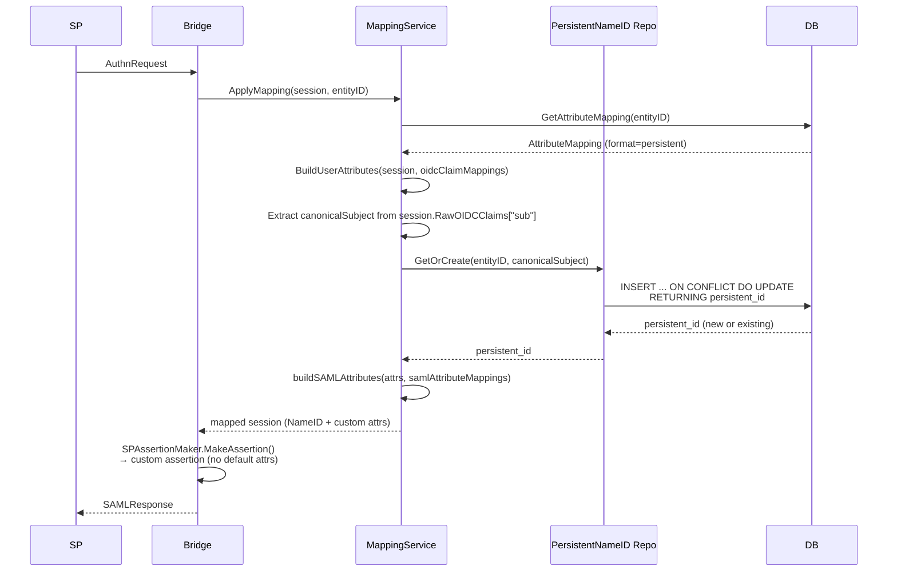

# Design Document: Per-SP Attribute Mapping — Phase 2

**Status**: Proposed
**Date**: 2026-05-28
**Prerequisite**: [Phase 2
Requirements](../requirement/per-sp-attribute-mapping-v2-requirements.md)

---

## Table of Contents

1. [Overview](#1-overview)
2. [Design Goals & Constraints](#2-design-goals--constraints)
3. [Data Model Changes](#3-data-model-changes)
4. [Code Architecture](#4-code-architecture)
5. [API Design](#5-api-design)
6. [Component Interaction Flow](#61-assertion-flow-with-persistent-nameid-new)
7. [Migration Strategy](#7-migration-strategy)
8. [Testing Strategy](#8-testing-strategy)
9. [Implementation Plan](#9-implementation-plan)
10. [Decision Log](#10-decision-log)

---

## 1. Overview

Phase 1 of the per-SP attribute mapping feature is complete. SPs can be
registered with per-SP `AttributeMapping` config, raw OIDC claims are stored in
sessions, and `MappingService.ApplyMapping()` applies per-SP mappings at
assertion time.

This Phase 2 design addresses the remaining gaps:

1. **`UserAttributes` struct**: Replace the untyped `map[string]string` internal
model with a structured type.
2. **`SAMLAttributeDef` struct**: Replace `SAMLAttributeMappings
map[string]string` with a richer type supporting `FriendlyName` and `NameFormat`
per attribute.
3. **Persistent NameID**: Opaque, pairwise-unique persistent identifiers per
(SP, user) pair via a dedicated table.
4. **Admin GET/PUT endpoints**: Retrieve and update SP attribute mappings via
the API.
5. **Custom `SPAssertionMaker`**: Replace the field-clearing workaround with a
proper custom `AssertionMaker` for full control over assertion construction.

---

## 2. Design Goals & Constraints

### Goals

| # | Goal |
| --- | ------ |
| G1 | Structured internal user model (`UserAttributes`) for type safety and clarity. |
| G2 | Per-attribute SAML metadata (`FriendlyName`, `NameFormat`) via `SAMLAttributeDef`. |
| G3 | True persistent NameID support — opaque, pairwise, stored in DB. |
| G4 | Admin API for reading and updating SP attribute mappings (GET/PUT). |
| G5 | Eliminate field-clearing workaround via custom `AssertionMaker`. |
| G6 | Catch misconfigured internal field references at configuration time via cross-map validation (FR-7). |

### Constraints

| # | Constraint |
| --- | ----------- |
| C1 | No forking `crewjam/saml` — use only `AssertionMaker` interface and `Session` struct. |
| C2 | Clean architecture: Domain → Repository → Service → Handler → App. |
| C3 | Mapping config stored as JSONB in PostgreSQL. Phase 1 backward compatibility is not required (project is pre-production). |
| C4 | No YAML config file support — DB + API + CLI are the configuration paths. |

---

## 3. Data Model Changes

### 3.1 `UserAttributes` — New Domain Struct

Replaces the `map[string]string` returned by `buildInternalModel()`.

```go
// UserAttributes represents the internal normalized user model.
// OIDC claims are extracted into this struct based on per-SP mapping config,
// and then this struct is used to build the SAML assertion.
type UserAttributes struct {
    Subject string            `json:"subject"`            // unique user identifier (OIDC sub)
    Email   string            `json:"email"`              // user email
    Name    string            `json:"name"`               // display name
    Groups  []string          `json:"groups,omitempty"`   // group memberships
    Custom  map[string]string `json:"custom,omitempty"`   // extensible key-value pairs
}
```

**Why a struct instead of `map[string]string`**:

- Type safety: `attrs.Email` vs `model["email"]` — compiler catches typos.
- Documentation: field comments describe semantics.
- Groups as `[]string` — eliminates the null-byte-separated encoding hack.
- `Custom` map preserves extensibility for non-standard OIDC claims.

#### Helper Methods

```go
// GetField returns the value of a well-known field by name.
// Returns empty string for unknown field names.
func (u *UserAttributes) GetField(name string) string {
    switch name {
    case "subject":
        return u.Subject
    case "email":
        return u.Email
    case "name":
        return u.Name
    default:
        return u.Custom[name]
    }
}
```

### 3.2 `SAMLAttributeDef` — New Domain Struct

Replaces `SAMLAttributeMappings map[string]string` with richer per-attribute
metadata.

```go
// SAMLAttributeDef defines how an internal field is emitted as a SAML attribute.
type SAMLAttributeDef struct {
    // Name is the SAML attribute Name (required).
    // Example: "urn:oid:0.9.2342.19200300.100.1.3" or "mail".
    Name string `json:"name"`

    // FriendlyName is the optional SAML FriendlyName.
    // Example: "mail".
    FriendlyName string `json:"friendly_name,omitempty"`

    // NameFormat is the SAML attribute NameFormat URI.
    // Default: "urn:oasis:names:tc:SAML:2.0:attrname-format:uri".
    NameFormat string `json:"name_format,omitempty"`
}

// DefaultNameFormat is the SAML attribute NameFormat applied when none is specified.
const DefaultNameFormat = "urn:oasis:names:tc:SAML:2.0:attrname-format:uri"

// EffectiveNameFormat returns the NameFormat, falling back to DefaultNameFormat.
func (d *SAMLAttributeDef) EffectiveNameFormat() string {
    if d.NameFormat != "" {
        return d.NameFormat
    }
    return DefaultNameFormat
}
```

### 3.3 Updated `AttributeMapping`

```go
type AttributeMapping struct {
    NameIDFormat   string                       `json:"nameid_format,omitempty"`
    SAMLAttributeMappings map[string]SAMLAttributeDef  `json:"saml_attribute_mappings,omitempty"`
    OIDCClaimMappings     map[string]string            `json:"oidc_claim_mappings,omitempty"`
    Options        MappingOptions               `json:"options,omitempty"`
}
```

> **Note**: Phase 1 stored `saml_attribute_mappings` (formerly
> `saml_attributes`) as `map[string]string`. Since the project is
> pre-production, Phase 1 backward compatibility is not required. Existing Phase
> 1 data should be re-registered using the Phase 2 format.

### 3.4 Updated Validation

#### Well-Known Internal Fields

```go
// WellKnownFields is the set of internal UserAttributes fields that are
// populated directly (not via the Custom map). Used for validation.
var WellKnownFields = map[string]bool{
    "subject": true,
    "email":   true,
    "name":    true,
    "groups":  true,
}
```

#### `Validate()` — Structural and Semantic Checks

```go
func (m *AttributeMapping) Validate() error {
    // Validate NameIDFormat
    validFormats := map[string]bool{
        "persistent": true, "transient": true, "emailaddress": true, "email": true, "unspecified": true, "": true,
    }
    if m.NameIDFormat != "" && !strings.HasPrefix(m.NameIDFormat, "urn:") && !validFormats[strings.ToLower(m.NameIDFormat)] {
        return &ErrValidation{
            Field:   "nameid_format",
            Message: fmt.Sprintf("invalid NameID format %q: must be one of persistent, transient, emailAddress, unspecified, or a full URN", m.NameIDFormat),
        }
    }

    // Validate SAMLAttributeDef entries
    for field, def := range m.SAMLAttributeMappings {
        if def.Name == "" {
            return &ErrValidation{
                Field:   "saml_attribute_mappings." + field + ".name",
                Message: "SAML attribute name is required",
            }
        }
    }

    // Semantic validation: every saml_attribute_mappings key must be resolvable.
    // A key is resolvable if it is a well-known field OR appears as a target
    // value in oidc_claim_mappings.
    if len(m.SAMLAttributeMappings) > 0 {
        // Collect all internal fields that will be populated via oidc_claim_mappings
        oidcTargets := make(map[string]bool)
        for _, internalField := range m.OIDCClaimMappings {
            oidcTargets[internalField] = true
        }

        for field := range m.SAMLAttributeMappings {
            if WellKnownFields[field] {
                continue // well-known field — always resolvable
            }
            if oidcTargets[field] {
                continue // custom field populated by an OIDC claim mapping
            }
            return &ErrValidation{
                Field:   "saml_attribute_mappings." + field,
                Message: fmt.Sprintf("internal field %q is not a well-known field (subject, email, name, groups) and is not a target in oidc_claim_mappings — this SAML attribute would never be populated", field),
            }
        }
    }

    return nil
}
```

**Why cross-map validation matters**: Without this check, a typo like `"emal"`
in
`oidc_claim_mappings` or an orphaned key in `saml_attribute_mappings` would be
silently
accepted. The misconfiguration would only surface at authentication time as a
missing
SAML attribute, with only a DEBUG-level log. By validating at configuration
time, admins
get immediate, actionable feedback.

### 3.5 `persistent_nameids` Table

```sql
CREATE TABLE IF NOT EXISTS persistent_nameids (
    entity_id     TEXT NOT NULL REFERENCES service_providers(entity_id) ON DELETE CASCADE,
    user_subject  TEXT NOT NULL,
    persistent_id TEXT NOT NULL,
    created_at    TIMESTAMPTZ NOT NULL DEFAULT NOW(),
    PRIMARY KEY (entity_id, user_subject)
);
```

- **Primary key on `(entity_id, user_subject)`**: ensures one persistent ID per
  (SP, user) pair.
- **`user_subject`**: the canonical OIDC `sub` claim, extracted directly from
  `session.RawOIDCClaims["sub"]`. This is the OIDC-guaranteed-stable user
  identifier — it is **not** the mapped `UserAttributes.Subject`, which can be
  reconfigured by admins via `oidc_claim_mappings`.
- **`ON DELETE CASCADE`**: cleaning up an SP removes its persistent NameIDs.
- **`persistent_id`**: UUID v4, generated on first authentication.

---

## 4. Code Architecture

### 4.1 `PersistentNameIDRepository` — New Repository Interface

```go
// PersistentNameIDRepository manages persistent NameID storage.
type PersistentNameIDRepository interface {
    // GetOrCreate returns the persistent NameID for the given (entityID, userSubject) pair.
    // userSubject must be the canonical OIDC sub claim (from RawOIDCClaims["sub"]),
    // not the mapped UserAttributes.Subject.
    // If none exists, it generates a new UUID v4, stores it, and returns it.
    // Concurrent calls for the same pair are safe (upsert with ON CONFLICT).
    GetOrCreate(ctx context.Context, entityID, userSubject string) (string, error)
}
}
```

### 4.2 Postgres Implementation

New file: `internal/repository/postgres/persistent_nameid.go`

```go
type PersistentNameIDRepo struct {
    pool   *pgxpool.Pool
    tracer tracing.TracingInterface
}

func NewPersistentNameIDRepo(pool *pgxpool.Pool, tracer tracing.TracingInterface) *PersistentNameIDRepo {
    return &PersistentNameIDRepo{pool: pool, tracer: tracer}
}

func (r *PersistentNameIDRepo) GetOrCreate(ctx context.Context, entityID, userSubject string) (string, error) {
    ctx, span := r.tracer.Start(ctx, "repo.persistent_nameid.get_or_create")
    defer span.End()

    persistentID := uuid.New().String()

    var result string
    err := r.pool.QueryRow(ctx,
        `INSERT INTO persistent_nameids (entity_id, user_subject, persistent_id)
         VALUES ($1, $2, $3)
         ON CONFLICT (entity_id, user_subject) DO UPDATE SET entity_id = persistent_nameids.entity_id
         RETURNING persistent_id`,
        entityID, userSubject, persistentID,
    ).Scan(&result)

    return result, err
}
```

The `ON CONFLICT ... DO UPDATE SET entity_id = persistent_nameids.entity_id` is
a no-op update that allows `RETURNING persistent_id` to work for both insert and
conflict cases.

### 4.3 Updated `MappingService`

The `MappingService` constructor gains a `PersistentNameIDRepository`
dependency:

```go
type mappingService struct {
    spRepo        repository.ServiceProviderRepository
    persistentIDs repository.PersistentNameIDRepository
    logger        logging.Logger
    tracer        tracing.TracingInterface
}

func NewMappingService(
    spRepo repository.ServiceProviderRepository,
    persistentIDs repository.PersistentNameIDRepository,
    logger logging.Logger,
    tracer tracing.TracingInterface,
) MappingService {
    return &mappingService{
        spRepo:        spRepo,
        persistentIDs: persistentIDs,
        logger:        logger,
        tracer:        tracer,
    }
}
```

#### Refactored `buildInternalModel` → `BuildUserAttributes`

Replaces the `map[string]string` approach:

```go
func BuildUserAttributes(session *domain.Session, oidcClaimMappings map[string]string, rawClaims map[string]interface{}) *domain.UserAttributes {
    // Default OIDC-to-internal mapping
    oidcToInternal := map[string]string{
        "sub": "subject", "email": "email", "name": "name", "groups": "groups",
    }
    if len(oidcClaimMappings) > 0 {
        oidcToInternal = oidcClaimMappings
    }

    attrs := &domain.UserAttributes{
        Custom: make(map[string]string),
    }

    // Extract from raw OIDC claims (preferred) or session fields (fallback)
    for oidcClaim, internalField := range oidcToInternal {
        value := extractClaimValue(rawClaims, oidcClaim)
        if value == "" {
            value = sessionFieldFallback(session, oidcClaim)
        }

        switch internalField {
        case "subject":
            attrs.Subject = value
        case "email":
            attrs.Email = value
        case "name":
            attrs.Name = value
        case "groups":
            attrs.Groups = splitGroups(rawClaims, oidcClaim, session.Groups)
        default:
            if value != "" {
                attrs.Custom[internalField] = value
            }
        }
    }

    return attrs
}
```

#### Persistent NameID Resolution

The `resolveNameID` function uses a **canonical subject** parameter — the raw
OIDC `sub` claim
extracted directly from `session.RawOIDCClaims["sub"]` — instead of
`attrs.Subject`. This ensures
persistent NameID lookups are always keyed by the OIDC-guaranteed-stable
identifier, regardless of
how the admin configures `oidc_claim_mappings`. Even if an admin maps `email` →
`subject`, persistent
NameIDs remain keyed by the immutable OIDC `sub`.

For the `persistent` format, the function **fails closed**: if the canonical
subject is empty or the
database call fails, it returns an error rather than falling back to a user
attribute. Silently
degrading to a non-opaque, non-pairwise value would violate FR-3 and the SAML
2.0 specification,
and would produce unstable NameIDs if the database recovers on the next request.

> **NameID format normalization**: The `NameIDFormat` is stored as the
> operator-provided short
> name (e.g., `"persistent"`, `"emailAddress"`) or full URN. Normalization to
> the SAML URN
> happens only at assertion time via `nameIDFormatToURN()`. This keeps stored
> config readable
> and avoids lossy normalization at write time. `Validate()` rejects
> unrecognized short names
> that are not full URNs.

```go
func (s *mappingService) resolveNameID(ctx context.Context, canonicalSubject string, attrs *domain.UserAttributes, mapping *domain.AttributeMapping, entityID string) (string, string, error) {
    format := nameIDFormatToURN(mapping.NameIDFormat)
    logger := logging.FromContext(ctx, s.logger)

    logger.Debugw("Resolving NameID",
        "entityID", entityID,
        "format", mapping.NameIDFormat,
    )

    switch strings.ToLower(mapping.NameIDFormat) {
    case "persistent":
        if canonicalSubject == "" {
            return "", format, fmt.Errorf("persistent NameID requires OIDC sub claim, but it is empty for SP %s", entityID)
        }
        persistentID, err := s.persistentIDs.GetOrCreate(ctx, entityID, canonicalSubject)
        if err != nil {
            return "", format, fmt.Errorf("failed to resolve persistent NameID for SP %s: %w", entityID, err)
        }
        logger.Infow("Resolved persistent NameID",
            "entityID", entityID,
            "canonicalSubject", canonicalSubject,
        )
        return persistentID, format, nil

    case "emailaddress", "email":
        return attrs.Email, format, nil

    case "transient":
        return uuid.New().String(), format, nil

    default:
        return attrs.Email, format, nil
    }
}
```

**Caller responsibility**: `ApplyMapping()` extracts the canonical subject from
`session.RawOIDCClaims["sub"]`
and passes it to `resolveNameID()`. If `resolveNameID()` returns an error for
the `persistent` format,
`ApplyMapping()` must propagate the error — the assertion cannot be built
without a valid persistent NameID.

#### Updated SAML Attribute Building

Uses `SAMLAttributeDef` for per-attribute metadata:

```go
func buildSAMLAttributes(attrs *domain.UserAttributes, samlMappings map[string]domain.SAMLAttributeDef, logger logging.Logger, entityID string) []domain.Attribute {
    var result []domain.Attribute

    for internalField, def := range samlMappings {
        // Handle groups (multi-valued)
        if internalField == "groups" {
            if len(attrs.Groups) > 0 {
                var values []domain.AttributeValue
                for _, g := range attrs.Groups {
                    values = append(values, domain.AttributeValue{Type: "xs:string", Value: g})
                }
                result = append(result, domain.Attribute{
                    Name:         def.Name,
                    FriendlyName: def.FriendlyName,
                    NameFormat:   def.EffectiveNameFormat(),
                    Values:       values,
                })
            } else {
                logger.Debugw("Mapped SAML attribute omitted: no groups available",
                    "entityID", entityID,
                    "internalField", internalField,
                    "samlAttrName", def.Name,
                )
            }
            continue
        }

        // Single-valued field
        value := attrs.GetField(internalField)
        if value == "" {
            logger.Debugw("Mapped SAML attribute omitted: claim value empty",
                "entityID", entityID,
                "internalField", internalField,
                "samlAttrName", def.Name,
            )
            continue
        }

        result = append(result, domain.Attribute{
            Name:         def.Name,
            FriendlyName: def.FriendlyName,
            NameFormat:   def.EffectiveNameFormat(),
            Values:       []domain.AttributeValue{{Type: "xs:string", Value: value}},
        })
    }

    logger.Debugw("Built SAML attributes",
        "entityID", entityID,
        "mappedCount", len(result),
        "totalConfigured", len(samlMappings),
    )

    return result
}
```

### 4.4 Custom `SPAssertionMaker`

#### Decision: Custom AssertionMaker vs. Current Field-Clearing Approach

| Aspect | Current (Field-Clearing) | Custom `SPAssertionMaker` |
| -------- | -------------------------- | --------------------------- |
| Mechanism | Clear built-in Session fields, populate `CustomAttributes`, delegate to `DefaultAssertionMaker` | Implement `saml.AssertionMaker` interface; construct assertion directly |
| Default attribute suppression | Works by clearing fields; fragile if library adds new defaults | Complete control; no defaults emitted |
| NameID control | `Session.NameID` + `Session.NameIDFormat` | Direct `<NameID>` construction |
| Complexity | Low (current code is ~50 lines) | Medium (~80 lines; mirrors `DefaultAssertionMaker` structure) |
| Library coupling | Relies on internal behavior of `DefaultAssertionMaker` (which fields emit which attributes) | Only depends on the stable `AssertionMaker` interface |

**Decision**: Implement `SPAssertionMaker`.

**Rationale**: The field-clearing approach is fragile. If `crewjam/saml` adds
new default attributes in a future version, they would leak into mapped
assertions. The `AssertionMaker` interface is the library's designated extension
point — using it isolates us from `DefaultAssertionMaker` internals.

#### Implementation

New file: `internal/handler/assertion_maker.go`

```go
// SPAssertionMaker implements saml.AssertionMaker with per-SP attribute mapping.
// For SPs without mapping config, it delegates to DefaultAssertionMaker.
type SPAssertionMaker struct {
    mapping      service.MappingService
    spService    service.ServiceProviderService
    logger       logging.Logger
    defaultMaker saml.DefaultAssertionMaker
}

func NewSPAssertionMaker(
    mapping service.MappingService,
    spService service.ServiceProviderService,
    logger logging.Logger,
) *SPAssertionMaker {
    return &SPAssertionMaker{
        mapping:   mapping,
        spService: spService,
        logger:    logger,
    }
}

func (m *SPAssertionMaker) MakeAssertion(req *saml.IdpAuthnRequest, session *saml.Session) error {
    entityID := req.ServiceProviderMetadata.EntityID

    // Look up SP to check if it has a mapping config
    ctx := context.Background()
    sp, err := m.spService.GetByEntityID(ctx, entityID)
    if err != nil {
        // SP lookup failed — this is unexpected since the SP was resolved earlier
        // in the request pipeline. Return an error rather than falling back to
        // DefaultAssertionMaker, which would emit default attributes for a session
        // that may have already been enriched by ApplyMapping().
        m.logger.Errorw("SP lookup failed in assertion maker", "entityID", entityID, "error", err)
        return fmt.Errorf("failed to look up SP %s for assertion: %w", entityID, err)
    }

    if sp.AttributeMapping == nil || len(sp.AttributeMapping.SAMLAttributeMappings) == 0 {
        // No SAML attribute mappings configured — delegate to default behavior.
        // This covers both truly unmapped SPs (nil AttributeMapping) and SPs with
        // only nameid_format set (no saml_attribute_mappings). In the latter case,
        // the NameID format was already applied by MappingService.ApplyMapping()
        // via session.NameID/session.NameIDFormat, but default attributes are
        // preserved by delegating to DefaultAssertionMaker.
        return m.defaultMaker.MakeAssertion(req, session)
    }

    // SP has mapping — the session was already enriched by MappingService.ApplyMapping()
    // in SAMLSessionAdapter.GetSession(). Build assertion with custom attributes.
    m.buildCustomAssertion(req, session)
    return nil
}
```

The `buildCustomAssertion` method replicates the structural logic from
`DefaultAssertionMaker.MakeAssertion` (issuer, subject, conditions, authn
statement, timing) but uses only `session.CustomAttributes` for the attribute
statement, and `session.NameID`/`session.NameIDFormat` for the `<NameID>`
element. The default OID-based attributes (`uid`, `mail`, `cn`, etc.) are not
emitted.

#### Required Assertion Structural Elements

`buildCustomAssertion` **must** produce all of the following XML elements,
matching
the structure of `DefaultAssertionMaker`. Omission of any element can cause
silent
authentication failures at the SP:

| XML Element | Source | Notes |
| ------------- | -------- | ------- |
| `<saml:Issuer>` | `req.IDP.Metadata().EntityID` | Must match IDP metadata |
| `<saml:Subject>` | — | Container for NameID + SubjectConfirmation |
| `<saml:NameID>` | `session.NameID`, `session.NameIDFormat` | Format from mapping config |
| `<saml:SubjectConfirmation Method="bearer">` | — | Required for Web SSO profile |
| `<saml:SubjectConfirmationData>` | `InResponseTo`, `Recipient` (ACS URL), `NotOnOrAfter` | Binds assertion to request |
| `<saml:Conditions>` | `NotBefore`, `NotOnOrAfter` | Validity window |
| `<saml:AudienceRestriction>` | SP EntityID | Restricts assertion to intended SP |
| `<saml:AuthnStatement>` | `AuthnInstant`, `SessionIndex`, `SessionNotOnOrAfter` | Proves authentication occurred |
| `<saml:AuthnContext>` | `AuthnContextClassRef` | Authentication method reference |
| `<saml:AttributeStatement>` | `session.CustomAttributes` only | **No default OID attributes** |

**Timing fields**: `NotBefore = now - 5m`, `NotOnOrAfter = now + lifetime`,
matching
`DefaultAssertionMaker` behavior. The `SessionNotOnOrAfter` must equal
`session.ExpireTime`.

#### Integration

In `internal/app/app.go`, when wiring the SAML IDP:

```go
samlIDP.AssertionMaker = handler.NewSPAssertionMaker(mappingService, spService, logger)
```

#### Unmapped SP Behavior

- SPs **without** `AttributeMapping` (or with empty `SAMLAttributeMappings`):
  `SPAssertionMaker` delegates to `DefaultAssertionMaker` → standard default
  behavior. This includes SPs configured with only `nameid_format` and no
  `saml_attribute_mappings` — they get default attributes with the configured
  NameID format applied via `session.NameID`/`session.NameIDFormat`.
- SPs **with** non-empty `SAMLAttributeMappings`: `SPAssertionMaker` constructs
  assertion using only the mapped attributes → no default attribute leakage.
- The existing `MappingService.ApplyMapping()` continues to populate
  `session.CustomAttributes` and set `session.NameID`/`session.NameIDFormat`.
  The `SPAssertionMaker` consumes these.

### 4.5 Removing the Field-Clearing Workaround

Once `SPAssertionMaker` is in place, the field-clearing logic in
`MappingService.ApplyMapping()` (lines 74–81 of `attribute_mapping.go`) can be
removed. The mapped session still populates `CustomAttributes`, `NameID`, and
`NameIDFormat`, but no longer needs to clear `UserEmail`, `UserCommonName`, etc.

---

## 5. API Design

### 5.1 Get SP Config — `GET /admin/service-providers?entity_id=...`

Returns the full SP configuration including attribute mapping.

> **Design Note**: SAML EntityIDs are commonly URLs containing `/`, `:`, `?`,
> etc.
> Using them as path parameters is unsafe without strict encoding conventions.
> A query parameter avoids this ambiguity entirely — clients pass the raw
> EntityID
> as a query string value (standard percent-encoding applies automatically).

**Request**: `GET
/admin/service-providers?entity_id=https%3A%2F%2Fsp1.example.com%2Fsaml`

**Response (200 OK)**:

```json
{
    "entity_id": "https://sp1.example.com/saml",
    "acs_url": "https://sp1.example.com/saml/acs",
    "acs_binding": "urn:oasis:names:tc:SAML:2.0:bindings:HTTP-POST",
    "attribute_mapping": {
        "nameid_format": "persistent",
        "saml_attribute_mappings": {
            "email": {
                "name": "urn:oid:0.9.2342.19200300.100.1.3",
                "friendly_name": "mail",
                "name_format": "urn:oasis:names:tc:SAML:2.0:attrname-format:uri"
            },
            "name": {
                "name": "urn:oid:2.16.840.1.113730.3.1.241",
                "friendly_name": "displayName"
            }
        },
        "oidc_claim_mappings": {
            "sub": "subject",
            "email": "email",
            "name": "name"
        },
        "options": {
            "lowercase_email": true
        }
    }
}
```

**Error responses**:

- `400 Bad Request` — missing or empty `entity_id` query parameter.
- `404 Not Found` — entity_id not registered.

### 5.2 Update Attribute Mapping — `PUT /admin/service-providers/attribute-mapping?entity_id=...`

Accepts an `AttributeMapping` JSON body. Validates and stores it.

**Request**: `PUT
/admin/service-providers/attribute-mapping?entity_id=https%3A%2F%2Fsp1.example.com%2Fsaml`

**Request body**:

```json
{
    "nameid_format": "persistent",
    "saml_attribute_mappings": {
        "email": {
            "name": "mail",
            "friendly_name": "mail"
        }
    },
    "oidc_claim_mappings": {
        "sub": "subject",
        "email": "email"
    },
    "options": {
        "lowercase_email": true
    }
}
```

**Response**:

- `200 OK` — `{"status": "success", "message": "Attribute mapping updated"}`
- `400 Bad Request` — validation error details.
- `404 Not Found` — entity_id doesn't exist.

### 5.3 Delete Attribute Mapping — `DELETE /admin/service-providers/attribute-mapping?entity_id=...`

Clears the SP's attribute mapping, reverting it to default (unmapped) behavior.

**Request**: `DELETE
/admin/service-providers/attribute-mapping?entity_id=https%3A%2F%2Fsp1.example.com%2Fsaml`

**Response**:

- `200 OK` — `{"status": "success", "message": "Attribute mapping cleared"}`
- `404 Not Found` — entity_id doesn't exist.

This sets `attribute_mapping` to `NULL` in the database, causing
`SPAssertionMaker` to
delegate to `DefaultAssertionMaker` — identical to an SP registered without
mapping config.

> **Note**: An empty object `{}` sent via `PUT` is **not** equivalent to
> clearing — it is
> treated as a configured mapping with all defaults (NameIDFormat defaults to
> transient, no
> SAML attributes emitted, default OIDC claim extraction). Use `DELETE` to fully
> revert.

### 5.4 Handler Implementation

#### Response DTO

The GET endpoint uses an explicit response DTO to control JSON serialization,
since `domain.ServiceProvider` has no JSON tags:

```go
// GetSPResponse is the JSON response DTO for GET /admin/service-providers.
type GetSPResponse struct {
    EntityID         string                   `json:"entity_id"`
    ACSURL           string                   `json:"acs_url"`
    ACSBinding       string                   `json:"acs_binding"`
    AttributeMapping *domain.AttributeMapping `json:"attribute_mapping,omitempty"`
}

func spToResponse(sp *domain.ServiceProvider) *GetSPResponse {
    return &GetSPResponse{
        EntityID:         sp.EntityID,
        ACSURL:           sp.ACSURL,
        ACSBinding:       sp.ACSBinding,
        AttributeMapping: sp.AttributeMapping,
    }
}
```

#### GET Handler

```go
func (h *Handlers) HandleGetServiceProvider(w http.ResponseWriter, r *http.Request) {
    entityID := r.URL.Query().Get("entity_id")
    if entityID == "" {
        WriteJSON(w, http.StatusBadRequest, APIError{
            Status:  http.StatusBadRequest,
            Message: "entity_id query parameter is required",
        })
        return
    }

    sp, err := h.spService.GetByEntityID(r.Context(), entityID)
    if err != nil {
        WriteError(w, err)
        return
    }

    WriteJSON(w, http.StatusOK, spToResponse(sp))
}
```

#### PUT Handler

```go
func (h *Handlers) HandleUpdateAttributeMapping(w http.ResponseWriter, r *http.Request) {
    entityID := r.URL.Query().Get("entity_id")
    if entityID == "" {
        WriteJSON(w, http.StatusBadRequest, APIError{
            Status:  http.StatusBadRequest,
            Message: "entity_id query parameter is required",
        })
        return
    }

    var mapping domain.AttributeMapping
    if err := json.NewDecoder(r.Body).Decode(&mapping); err != nil {
        WriteJSON(w, http.StatusBadRequest, APIError{
            Status:  http.StatusBadRequest,
            Message: "invalid JSON",
        })
        return
    }
    if err := mapping.Validate(); err != nil {
        WriteError(w, err)
        return
    }

    if err := h.spService.UpdateAttributeMapping(r.Context(), entityID, &mapping); err != nil {
        WriteError(w, err)
        return
    }

    WriteJSON(w, http.StatusOK, map[string]string{
        "status":  "success",
        "message": "Attribute mapping updated",
    })
}
```

#### DELETE Handler

```go
func (h *Handlers) HandleDeleteAttributeMapping(w http.ResponseWriter, r *http.Request) {
    entityID := r.URL.Query().Get("entity_id")
    if entityID == "" {
        WriteJSON(w, http.StatusBadRequest, APIError{
            Status:  http.StatusBadRequest,
            Message: "entity_id query parameter is required",
        })
        return
    }

    if err := h.spService.ClearAttributeMapping(r.Context(), entityID); err != nil {
        WriteError(w, err)
        return
    }

    WriteJSON(w, http.StatusOK, map[string]string{
        "status":  "success",
        "message": "Attribute mapping cleared",
    })
}
```

### 5.5 Route Registration

```go
func (h *Handlers) RegisterRoutes(r chi.Router) {
    // ...existing routes...

    // Admin API - SP management
    r.Get("/admin/service-providers", h.HandleGetServiceProvider)
    r.Put("/admin/service-providers/attribute-mapping", h.HandleUpdateAttributeMapping)
    r.Delete("/admin/service-providers/attribute-mapping", h.HandleDeleteAttributeMapping)
}
```

### 5.5 Service Layer Addition

Add to `ServiceProviderService` interface:

```go
type ServiceProviderService interface {
    Register(ctx context.Context, sp *domain.ServiceProvider) error
    GetByEntityID(ctx context.Context, entityID string) (*domain.ServiceProvider, error)
    UpdateAttributeMapping(ctx context.Context, entityID string, mapping *domain.AttributeMapping) error
    ClearAttributeMapping(ctx context.Context, entityID string) error
}
```

#### Service-Layer Validation (Defense-in-Depth)

`UpdateAttributeMapping` must validate the mapping before persisting, ensuring
that internal callers (CLI, scheduled jobs, future gRPC) cannot bypass
validation
(NFR-5):

```go
func (s *serviceProviderService) UpdateAttributeMapping(ctx context.Context, entityID string, mapping *domain.AttributeMapping) error {
    ctx, span := s.tracer.Start(ctx, "service.sp.update_attribute_mapping")
    defer span.End()

    logger := logging.FromContext(ctx, s.logger)

    // Defense-in-depth: validate even though the handler also validates.
    // This ensures CLI/internal callers cannot bypass validation (NFR-5).
    if err := mapping.Validate(); err != nil {
        return err
    }

    // Verify SP exists before updating
    if _, err := s.repo.GetByEntityID(ctx, entityID); err != nil {
        return err
    }

    if err := s.repo.UpdateAttributeMapping(ctx, entityID, mapping); err != nil {
        return err
    }

    // NFR-4: Log mapping update events for observability
    logger.Infow("Attribute mapping updated",
        "entityID", entityID,
        "nameid_format", mapping.NameIDFormat,
        "saml_attributes_count", len(mapping.SAMLAttributeMappings),
        "oidc_claims_count", len(mapping.OIDCClaimMappings),
    )

    return nil
}
```

`ClearAttributeMapping` sets the mapping to `NULL`, reverting the SP to default
behavior:

```go
func (s *serviceProviderService) ClearAttributeMapping(ctx context.Context, entityID string) error {
    ctx, span := s.tracer.Start(ctx, "service.sp.clear_attribute_mapping")
    defer span.End()

    logger := logging.FromContext(ctx, s.logger)

    // Verify SP exists before clearing
    if _, err := s.repo.GetByEntityID(ctx, entityID); err != nil {
        return err
    }

    if err := s.repo.UpdateAttributeMapping(ctx, entityID, nil); err != nil {
        return err
    }

    logger.Infow("Attribute mapping cleared", "entityID", entityID)

    return nil
}
```

Add to `ServiceProviderRepository` interface:

```go
type ServiceProviderRepository interface {
    Save(ctx context.Context, sp *domain.ServiceProvider) error
    GetByEntityID(ctx context.Context, entityID string) (*domain.ServiceProvider, error)
    GetAttributeMapping(ctx context.Context, entityID string) (*domain.AttributeMapping, error)
    UpdateAttributeMapping(ctx context.Context, entityID string, mapping *domain.AttributeMapping) error
}
```

### 5.6 CLI Changes — Unified Mapping Input

#### Current State (Phase 1)

```bash
# Two separate flags — nameid-format is silently ignored when file is present
identity-saml-provider sp add \
  --entity-id https://sp.example.com \
  --acs-url https://sp.example.com/saml/acs \
  --attribute-mapping-file mapping.json \
  --nameid-format persistent  # silently ignored
```

#### Phase 2 Design

Remove `--nameid-format` and keep `--attribute-mapping-file` as the single input
path.

```bash
# Full mapping via file (unchanged)
identity-saml-provider sp add \
  --entity-id https://sp.example.com \
  --acs-url https://sp.example.com/saml/acs \
  --attribute-mapping-file mapping.json

# Minimal nameid-only config via file (replaces --nameid-format)
# nameid-only.json: {"nameid_format": "persistent"}
identity-saml-provider sp add \
  --entity-id https://sp.example.com \
  --acs-url https://sp.example.com/saml/acs \
  --attribute-mapping-file nameid-only.json
```

#### Updated `buildServiceProvider()`

```go
func buildServiceProvider() (*domain.ServiceProvider, error) {
    sp := &domain.ServiceProvider{
        EntityID:   spEntityID,
        ACSURL:     spACSURL,
        ACSBinding: spACSBinding,
    }

    if spAttributeMappingFile != "" {
        data, err := os.ReadFile(spAttributeMappingFile)
        if err != nil {
            return nil, fmt.Errorf("read attribute mapping file %q: %w", spAttributeMappingFile, err)
        }
        var mapping domain.AttributeMapping
        if err := json.Unmarshal(data, &mapping); err != nil {
            return nil, fmt.Errorf("parse attribute mapping JSON from %q: %w", spAttributeMappingFile, err)
        }
        sp.AttributeMapping = &mapping
    }

    if err := sp.Validate(); err != nil {
        return nil, err
    }

    return sp, nil
}
```

---

### 6.1 Assertion Flow With Persistent NameID (New)

```text
SP → AuthnRequest → /saml/sso
    → SAMLSessionAdapter.GetSession()
        → SessionService.GetByID() → session with raw OIDC claims
        → MappingService.ApplyMapping():
            1. GetAttributeMapping(entityID) → SAMLAttributeDef mappings
            2. BuildUserAttributes(session, oidcClaimMappings, rawClaims)
            3. ApplyTransforms (lowercase_email)
            4. Extract canonicalSubject from session.RawOIDCClaims["sub"]
            5. resolveNameID(canonicalSubject, ...):
                a. format=persistent → PersistentNameIDRepo.GetOrCreate(entityID, canonicalSubject)
                   (fails closed on error — no fallback to user attributes)
                b. format=transient → uuid.New()
                c. format=emailAddress → attrs.Email
            6. buildSAMLAttributes(attrs, mapping.SAMLAttributeMappings)
                → Uses SAMLAttributeDef.Name, FriendlyName, NameFormat
            7. Set session.CustomAttributes, session.NameID, session.NameIDFormat
        → Return mapped session
    → SPAssertionMaker.MakeAssertion():
        → SP lookup error? → return error (no fallback to default)
        → SP has mapping? → buildCustomAssertion (custom attrs + NameID only)
        → SP has no mapping? → DefaultAssertionMaker (unmapped SP behavior)
    → SAML Response → SP ACS URL
```

### 6.2 Admin Update Flow (New)

```text
Admin → PUT /admin/service-providers/attribute-mapping?entity_id=...
    → Handler: extract entity_id from query, decode JSON, validate
    → ServiceProviderService.UpdateAttributeMapping()
        → mapping.Validate() (defense-in-depth)
        → ServiceProviderRepository.UpdateAttributeMapping()
            → UPDATE service_providers SET attribute_mapping = $2 WHERE entity_id = $1
        → Log: "Attribute mapping updated" (INFO)
    → 200 OK

Admin → DELETE /admin/service-providers/attribute-mapping?entity_id=...
    → Handler: extract entity_id from query
    → ServiceProviderService.ClearAttributeMapping()
        → Verify SP exists
        → ServiceProviderRepository.UpdateAttributeMapping(entityID, nil)
            → UPDATE service_providers SET attribute_mapping = NULL WHERE entity_id = $1
        → Log: "Attribute mapping cleared" (INFO)
    → 200 OK
```

### 6.3 Sequence Diagram — Persistent NameID



---

### 6.4 Observability Design (NFR-4)

NFR-4 requires that persistent NameID creation and mapping resolution decisions
are
observable through structured logging and tracing. The following table specifies
all
required logging/tracing points:

| Component | Event | Level | Key Fields | Purpose |
| ----------- | ------- | ------- | ------------ | --------- |
| `MappingService.ApplyMapping` | Mapping applied | DEBUG | `entityID` | Confirm mapping path activated |
| `MappingService.resolveNameID` | NameID format selected | DEBUG | `entityID`, `format` | Trace NameID format decision |
| `MappingService.resolveNameID` | Persistent NameID resolved | INFO | `entityID`, `canonicalSubject` | Audit persistent ID usage |
| `buildSAMLAttributes` | Attribute omitted (empty claim) | DEBUG | `entityID`, `internalField`, `samlAttrName` | Diagnose missing claims |
| `buildSAMLAttributes` | Attributes built | DEBUG | `entityID`, `mappedCount`, `totalConfigured` | Confirm attribute emission |
| `ServiceProviderService.UpdateAttributeMapping` | Mapping updated | INFO | `entityID`, `nameid_format`, counts | Audit admin changes |
| `SPAssertionMaker.MakeAssertion` | Custom assertion built | DEBUG | `entityID`, `attributeCount` | Trace assertion path |
| `SPAssertionMaker.MakeAssertion` | Delegated to DefaultAssertionMaker | DEBUG | `entityID` | Trace unmapped path |

#### PersistentNameIDRepo

```go
func (r *PersistentNameIDRepo) GetOrCreate(ctx context.Context, entityID, userSubject string) (string, error) {
    ctx, span := r.tracer.Start(ctx, "repo.persistent_nameid.get_or_create")
    defer span.End()

    persistentID := uuid.New().String()

    var result string
    err := r.pool.QueryRow(ctx,
        `INSERT INTO persistent_nameids (entity_id, user_subject, persistent_id)
         VALUES ($1, $2, $3)
         ON CONFLICT (entity_id, user_subject) DO UPDATE SET entity_id = persistent_nameids.entity_id
         RETURNING persistent_id`,
        entityID, userSubject, persistentID,
    ).Scan(&result)

    return result, err
}
```

---

## 7. Migration Strategy

### 7.1 Database Migration — `003_add_persistent_nameids.sql`

```sql
-- +goose Up
-- +goose StatementBegin

-- Persistent NameID storage: stable opaque IDs per (SP, user) pair.
CREATE TABLE IF NOT EXISTS persistent_nameids (
    entity_id     TEXT NOT NULL REFERENCES service_providers(entity_id) ON DELETE CASCADE,
    user_subject  TEXT NOT NULL,
    persistent_id TEXT NOT NULL,
    created_at    TIMESTAMPTZ NOT NULL DEFAULT NOW(),
    PRIMARY KEY (entity_id, user_subject)
);

-- +goose StatementEnd

-- +goose Down
-- +goose StatementBegin

DROP TABLE IF EXISTS persistent_nameids;

-- +goose StatementEnd
```

### 7.2 JSONB Schema Evolution

No data migration is required. Since the project is pre-production, any existing
Phase 1 SP registrations with `map[string]string` format in
`saml_attribute_mappings` should be re-registered using the Phase 2
`SAMLAttributeDef` format. No backward-compatible deserialization is
implemented.

### 7.3 Unmapped SP Behavior

| Scenario | Behavior |
| ---------- | ---------- |
| SP with `attribute_mapping = NULL` | No mapping applied. `SPAssertionMaker` delegates to `DefaultAssertionMaker`. Standard default behavior. |
| SP with Phase 2 `saml_attribute_mappings` (object values) | Used directly via `SAMLAttributeDef`. |
| Existing sessions without `raw_oidc_claims` | `BuildUserAttributes` falls back to session fields. |

### 7.4 Rollback

- Dropping `persistent_nameids` table is clean (`ON DELETE CASCADE` only applies
  to forward references).
- `SPAssertionMaker` removal: revert `samlIDP.AssertionMaker` to nil (restores
  `DefaultAssertionMaker`).

---

## 8. Testing Strategy

### 8.1 Unit Tests — Domain

| Test | Description |
| ------ | ------------- |
| `TestUserAttributes_GetField` | Returns correct values for known fields and custom fields |
| `TestSAMLAttributeDef_EffectiveNameFormat` | Returns explicit format or default |
| `TestAttributeMapping_SAMLAttributeDef_Serialization` | Round-trip JSON serialization of `SAMLAttributeDef` format |
| `TestAttributeMapping_Validate_EmptySAMLAttrName` | Rejects `SAMLAttributeDef` with empty `Name` |
| `TestAttributeMapping_Validate_InvalidNameIDFormat` | Rejects invalid `nameid_format` (e.g., `"foobar"`) |
| `TestAttributeMapping_Validate_ValidNameIDFormats` | Accepts `persistent`, `transient`, `emailAddress`, `unspecified`, empty, and full URNs |
| `TestAttributeMapping_Validate_ValidSAMLAttrDef` | Accepts valid `SAMLAttributeDef` entries |
| `TestAttributeMapping_Validate_UnresolvableSAMLField` | Rejects `saml_attribute_mappings` key that is not a well-known field and not a target in `oidc_claim_mappings` |
| `TestAttributeMapping_Validate_CustomFieldWithOIDCSource` | Accepts custom `saml_attribute_mappings` key (e.g., `"dept"`) when it appears as a target in `oidc_claim_mappings` |
| `TestAttributeMapping_Validate_WellKnownFieldsAlwaysValid` | Well-known fields (`subject`, `email`, `name`, `groups`) are valid in `saml_attribute_mappings` even without `oidc_claim_mappings` |
| `TestAttributeMapping_Validate_TypoInOIDCTarget` | `oidc_claim_mappings` with `"email": "emal"` plus `saml_attribute_mappings` with `"email"` key is valid (both `"email"` is well-known and `"emal"` is an OIDC target), but `saml_attribute_mappings` with `"emal"` key and no OIDC target `"emal"` is rejected |

### 8.2 Unit Tests — Service

| Test | Description |
| ------ | ------------- |
| `TestBuildUserAttributes_DefaultMapping` | Default OIDC claim extraction produces expected struct fields |
| `TestBuildUserAttributes_CustomMapping` | Custom OIDCClaimMappings extracts non-standard claims into `Custom` map |
| `TestBuildUserAttributes_MissingClaims` | Missing OIDC claims result in empty fields |
| `TestBuildUserAttributes_Groups` | Groups extracted as `[]string` (no null-byte encoding) |
| `TestResolveNameID_Persistent` | Calls `PersistentNameIDRepo.GetOrCreate`, returns opaque ID |
| `TestResolveNameID_Persistent_EmptySub` | Returns error when OIDC sub claim is empty |
| `TestResolveNameID_Persistent_RepoError` | Returns error (fails closed, no fallback) |
| `TestResolveNameID_Persistent_NoFallback` | Persistent format never falls back to email or subject on any error path |
| `TestResolveNameID_Transient` | Generates unique random UUID |
| `TestResolveNameID_EmailAddress` | Returns email with correct format URI |
| `TestBuildSAMLAttributes_WithDef` | Produces attributes with correct `Name`, `FriendlyName`, `NameFormat` |
| `TestBuildSAMLAttributes_DefaultNameFormat` | Missing `NameFormat` defaults to URI format |
| `TestBuildSAMLAttributes_Groups` | Multi-valued attribute for groups |

### 8.3 Unit Tests — Handler

| Test | Description |
| ------ | ------------- |
| `TestSPAssertionMaker_NoMapping` | Delegates to `DefaultAssertionMaker` |
| `TestSPAssertionMaker_WithMapping` | Builds custom assertion with mapped attributes |
| `TestHandleGetServiceProvider_Found` | Returns 200 with SP config using response DTO |
| `TestHandleGetServiceProvider_NotFound` | Returns 404 |
| `TestHandleGetServiceProvider_MissingParam` | Returns 400 when entity_id query param is absent |
| `TestHandleUpdateAttributeMapping_Success` | Returns 200, mapping persisted |
| `TestHandleUpdateAttributeMapping_EmptyObject` | PUT with `{}` body returns 200, stores minimal mapping (valid but no attributes emitted) |
| `TestHandleUpdateAttributeMapping_InvalidConfig` | Returns 400 with validation error |
| `TestHandleUpdateAttributeMapping_InvalidNameIDFormat` | Returns 400 when `nameid_format` is not a recognized value or URN |
| `TestHandleUpdateAttributeMapping_SPNotFound` | Returns 404 |
| `TestHandleDeleteAttributeMapping_Success` | DELETE returns 200, mapping set to NULL (SP reverts to default behavior) |
| `TestHandleDeleteAttributeMapping_SPNotFound` | DELETE returns 404 for unknown entity_id |
| `TestHandleDeleteAttributeMapping_MissingParam` | DELETE returns 400 when entity_id is absent |

### 8.4 XML-Level Assertion Structure Tests

These tests verify that `buildCustomAssertion` produces structurally valid SAML
assertions with all required elements. They compare XML output against
`DefaultAssertionMaker` for structural parity (excluding attribute content):

| Test | Description |
| ------ | ------------- |
| `TestBuildCustomAssertion_HasIssuer` | Output XML contains `<saml:Issuer>` matching IDP EntityID |
| `TestBuildCustomAssertion_HasSubjectNameID` | Contains `<saml:NameID>` with correct Format and Value |
| `TestBuildCustomAssertion_HasSubjectConfirmation` | Contains `<saml:SubjectConfirmation Method="bearer">` with `InResponseTo`, `Recipient`, `NotOnOrAfter` |
| `TestBuildCustomAssertion_HasConditions` | Contains `<saml:Conditions>` with `NotBefore`, `NotOnOrAfter`, and `<saml:AudienceRestriction>` with SP EntityID |
| `TestBuildCustomAssertion_HasAuthnStatement` | Contains `<saml:AuthnStatement>` with `AuthnInstant`, `SessionIndex`, `SessionNotOnOrAfter` |
| `TestBuildCustomAssertion_HasAuthnContext` | Contains `<saml:AuthnContext><saml:AuthnContextClassRef>` |
| `TestBuildCustomAssertion_OnlyMappedAttributes` | `<saml:AttributeStatement>` contains only mapped attributes — no default OID attributes (`uid`, `mail`, `cn`, etc.) |
| `TestBuildCustomAssertion_StructuralParity` | Parse both `DefaultAssertionMaker` and `buildCustomAssertion` output; verify identical element hierarchy (Issuer, Subject, Conditions, AuthnStatement, AttributeStatement) differing only in attribute content |
| `TestBuildCustomAssertion_Timing` | `NotBefore`, `NotOnOrAfter`, `SessionNotOnOrAfter` match expected clock skew and lifetime values |

**Implementation approach**: Use `encoding/xml` to unmarshal assertion output
into
Go structs (or `etree` for XPath-based assertions) and verify structural
elements
exist with correct values. This catches regressions when `crewjam/saml` is
upgraded.

### 8.5 Integration Tests — Database

| Test | Description |
| ------ | ------------- |
| `TestPersistentNameIDRepo_GetOrCreate_New` | First call generates and stores a new ID |
| `TestPersistentNameIDRepo_GetOrCreate_Existing` | Second call returns same ID |
| `TestPersistentNameIDRepo_GetOrCreate_DifferentSPs` | Same user, different SPs → different IDs |
| `TestPersistentNameIDRepo_CascadeDelete` | Deleting SP removes persistent NameIDs |
| `TestServiceProviderRepo_UpdateAttributeMapping` | Round-trip: update, retrieve, compare |

### 8.5 Unmapped SP Tests

| Test | Description |
| ------ | ------------- |
| `TestExistingSP_NoMapping_DefaultAssertion` | SP with nil mapping → `DefaultAssertionMaker` → standard default assertion |

### 8.6 Unit Tests — CLI

| Test | Description |
| ------ | ------------- |
| `TestBuildServiceProvider_MappingFile` | `--attribute-mapping-file` loads and parses JSON into `sp.AttributeMapping` |
| `TestBuildServiceProvider_MinimalNameIDOnly` | File containing `{"nameid_format": "persistent"}` produces valid SP with `AttributeMapping.NameIDFormat == "persistent"` and no SAML attribute mappings |
| `TestBuildServiceProvider_NoMapping` | No `--attribute-mapping-file` flag → `sp.AttributeMapping` is nil |
| `TestBuildServiceProvider_InvalidJSON` | Malformed JSON file → clear error message |
| `TestBuildServiceProvider_FileNotFound` | Non-existent file path → clear error message |

---

## 9. Implementation Plan

### Phase 2a: Data Model Enhancement (1 PR)

**Goal**: Introduce `UserAttributes` and `SAMLAttributeDef` without changing
runtime behavior.

1. Add `UserAttributes` struct to `internal/domain/attribute_mapping.go`.
2. Add `SAMLAttributeDef` struct to `internal/domain/attribute_mapping.go`.
3. Change `AttributeMapping.SAMLAttributeMappings` type from `map[string]string`
to `map[string]SAMLAttributeDef`.
4. Update `Validate()` to check `SAMLAttributeDef.Name` is non-empty,
`NameIDFormat` is valid, and `saml_attribute_mappings` keys are resolvable
(well-known field or `oidc_claim_mappings` target).
5. Refactor `buildInternalModel()` → `BuildUserAttributes()` to return
`*domain.UserAttributes`.
6. Update `ApplyMapping()` to use `UserAttributes` and `SAMLAttributeDef`.
7. Update tests.
8. Run `make generate` to regenerate mocks.
9. Verify all existing tests pass — no behavioral change.

### Phase 2b: Persistent NameID (1 PR)

**Goal**: True persistent NameID support.

1. Create `migrations/003_add_persistent_nameids.sql`.
2. Add `PersistentNameIDRepository` interface to
`internal/repository/interfaces.go`.
3. Implement `PersistentNameIDRepo` in
`internal/repository/postgres/persistent_nameid.go`.
4. Update `MappingService` constructor to accept `PersistentNameIDRepository`.
5. Implement `resolveNameID()` with persistent ID lookup (canonical OIDC `sub`,
fail-closed on error).
6. Wire in `internal/app/app.go`.
7. Run `make generate` to regenerate mocks.
8. Add unit tests (service) and integration tests (repo).

### Phase 2c: Custom AssertionMaker (1 PR)

**Goal**: Replace field-clearing workaround with proper assertion control.

1. Create `internal/handler/assertion_maker.go` with `SPAssertionMaker`.
2. Wire `samlIDP.AssertionMaker` in `internal/app/app.go`.
3. Remove field-clearing logic from `MappingService.ApplyMapping()`.
4. Add unit tests for `SPAssertionMaker`.
5. Verify backward compatibility: SPs without mapping produce identical
assertions.

### Phase 2d: Admin API Endpoints (1 PR)

**Goal**: GET, PUT, and DELETE endpoints for SP attribute mapping management.

1. Add `UpdateAttributeMapping` and `ClearAttributeMapping` to
`ServiceProviderService` interface.
2. Add `UpdateAttributeMapping` to `ServiceProviderRepository` interface
(accepts `nil` for clear).
3. Implement Postgres `UpdateAttributeMapping`.
4. Add `HandleGetServiceProvider`, `HandleUpdateAttributeMapping`, and
`HandleDeleteAttributeMapping` handlers.
5. Register routes in `routes.go`.
6. Run `make generate` to regenerate mocks.
7. Add handler tests and integration tests.

### Phase 2e: Unified CLI Mapping Input (1 PR)

**Goal**: Remove `--nameid-format` and keep `--attribute-mapping-file` as the
single CLI input path for all mapping configuration.

1. Remove the `--nameid-format` flag from `sp add` command in
`internal/cmd/sp_add.go`.
2. Remove the `spNameIDFormat` variable and the `else if spNameIDFormat != ""`
branch in `buildServiceProvider()`.
3. Update help text and flag descriptions to document the minimal
`{"nameid_format": "persistent"}` pattern as the replacement for the old
`--nameid-format` shortcut.
4. Update README CLI documentation.
5. Add CLI tests covering: file-based input, minimal nameid-only JSON file, no
mapping flag, and invalid JSON.

---

## 10. Decision Log

| # | Decision | Options Considered | Choice | Rationale |
| --- | ---------- | ------------------- | -------- | ----------- |
| D1 | Internal user model type | A: `map[string]string` (current), B: `UserAttributes` struct | **B: Struct** | Type safety, compiler-checked field access, `Groups` as `[]string` (eliminates null-byte hack), extensible via `Custom` map |
| D2 | SAML attribute definition | A: `map[string]string` (current), B: `SAMLAttributeDef` struct | **B: Struct** | Supports `FriendlyName` and per-attribute `NameFormat` — both required by real-world SPs (e.g., NetSuite, ServiceNow) |
| D3 | Phase 1 JSONB compatibility | A: Data migration, B: Backward-compatible `UnmarshalJSON`, C: No compatibility (pre-production) | **C: No compatibility** | Project is pre-production — no Phase 1 data needs preserving. Eliminates deserialization complexity. Existing SPs should be re-registered. |
| D4 | Assertion control mechanism | A: Field-clearing (current), B: Custom `SPAssertionMaker` | **B: Custom maker** | Uses library's designated extension point; eliminates fragility of relying on `DefaultAssertionMaker` internals |
| D5 | Persistent NameID storage | A: Dedicated table (from original design), B: Defer | **A: Table** | Core requirement. `persistent` format without true opaque IDs violates SAML spec. |
| D6 | Config file support (YAML) | A: Include, B: Exclude | **B: Exclude** | DB + admin API + CLI provide complete configuration paths. YAML adds complexity without clear benefit for this project. |
| D7 | Persistent NameID lookup key | A: `UserAttributes.Subject` (mapped), B: Raw OIDC `sub` from `RawOIDCClaims` | **B: Raw OIDC `sub`** | The OIDC `sub` is guaranteed stable per the OIDC spec. Using the mapped subject would let admin misconfiguration (e.g., mapping `email` → `subject`) break NameID stability and orphan existing persistent IDs. |
| D8 | Persistent NameID error handling | A: Fall back to user attribute, B: Fail closed (return error) | **B: Fail closed** | Silently falling back to a non-opaque, non-pairwise value violates FR-3 and SAML 2.0 spec. A fallback that produces a different NameID on DB recovery breaks stability for the SP. |
| D9 | Internal field reference validation | A: No validation (current), B: Warn at runtime only, C: Reject at configuration time with cross-map validation | **C: Reject at config time** | Typos in internal field names (e.g., `"emal"`) are silently accepted without validation and only surface as missing SAML attributes at authentication time, with only DEBUG-level logs. Cross-map validation (every `saml_attribute_mappings` key must be well-known or an `oidc_claim_mappings` target) catches misconfigurations immediately with actionable error messages. Custom fields remain supported when consistently defined across both maps. |
| D10 | CLI mapping input flags | A: Keep both `--attribute-mapping-file` and `--nameid-format` (current), B: Remove `--nameid-format`, keep `--attribute-mapping-file` as sole input | **B: Single flag** | The two flags create an implicit priority hierarchy where `--attribute-mapping-file` silently overrides `--nameid-format` with no warning. `NameIDFormat` is a field inside `AttributeMapping`, not an independent concept — having a separate flag creates false separation. The Phase 2 config is richer (`SAMLAttributeDef`, cross-map validation, options), so cherry-picking individual fields as flags doesn't scale. A minimal `{"nameid_format": "persistent"}` JSON file preserves the convenience of the old `--nameid-format` shortcut. |

---

## Appendix A: Example Configurations (Phase 2 Format)

### A.1 NetSuite SP (emailAddress NameID, per-attribute metadata)

```json
{
    "nameid_format": "emailAddress",
    "oidc_claim_mappings": {
        "sub": "subject",
        "email": "email",
        "name": "name"
    },
    "saml_attribute_mappings": {
        "email": {
            "name": "email",
            "friendly_name": "email",
            "name_format": "urn:oasis:names:tc:SAML:2.0:attrname-format:basic"
        },
        "name": {
            "name": "name",
            "friendly_name": "displayName",
            "name_format": "urn:oasis:names:tc:SAML:2.0:attrname-format:basic"
        }
    },
    "options": {
        "lowercase_email": true
    }
}
```

### A.2 Enterprise SP (persistent NameID, OID attribute names)

```json
{
    "nameid_format": "persistent",
    "oidc_claim_mappings": {
        "sub": "subject",
        "email": "email",
        "name": "name",
        "groups": "groups"
    },
    "saml_attribute_mappings": {
        "email": {
            "name": "urn:oid:0.9.2342.19200300.100.1.3",
            "friendly_name": "mail",
            "name_format": "urn:oasis:names:tc:SAML:2.0:attrname-format:uri"
        },
        "name": {
            "name": "urn:oid:2.16.840.1.113730.3.1.241",
            "friendly_name": "displayName",
            "name_format": "urn:oasis:names:tc:SAML:2.0:attrname-format:uri"
        },
        "groups": {
            "name": "urn:oid:1.2.840.113556.1.4.221",
            "friendly_name": "memberOf",
            "name_format": "urn:oasis:names:tc:SAML:2.0:attrname-format:uri"
        }
    }
}
```

### A.3 Simple SP (LDAP-style attribute names, no FriendlyName)

```json
{
    "nameid_format": "transient",
    "saml_attribute_mappings": {
        "email": {
            "name": "mail"
        },
        "name": {
            "name": "cn"
        },
        "groups": {
            "name": "memberOf"
        }
    }
}
```
