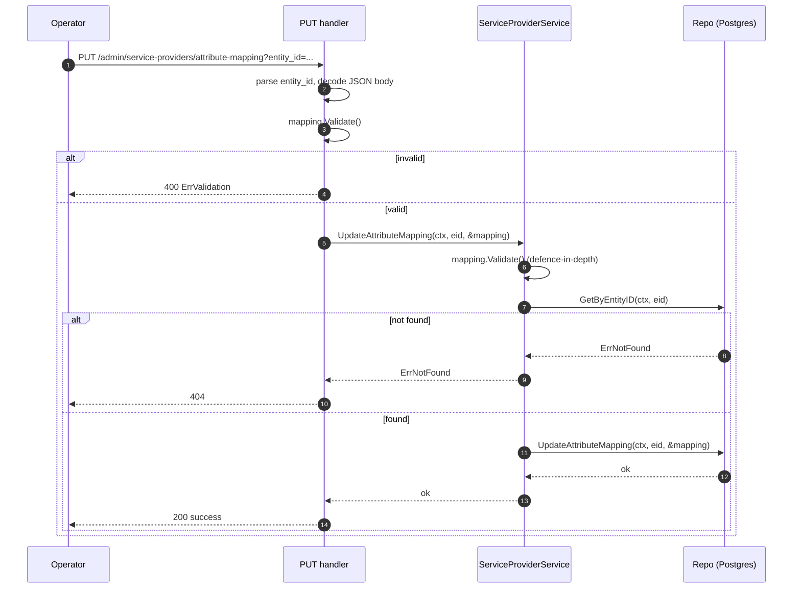

## Context

The bridge already exposes one admin endpoint, `POST /admin/service-providers`,
which registers an SP with an optional `attribute_mapping`. Everything
else — including the `attribute_mapping` JSONB column on
`service_providers` — is invisible and immutable from outside the
process. The Phase 1 → Phase 2 migration (FR-4, FR-5 in
`docs/requirement/per-sp-attribute-mapping-v2-requirements.md`)
identified this as a blocker for production onboarding: operators must
be able to read and re-write an SP's mapping without re-registering it.

Current relevant surface:

- `internal/handler/routes.go` registers `POST /admin/service-providers`
  and the SAML routes; nothing else under `/admin`.
- `internal/service/interfaces.go` exposes
  `ServiceProviderService { Register, GetByEntityID }`.
- `internal/repository/interfaces.go` exposes
  `ServiceProviderRepository { Save, GetByEntityID, GetAttributeMapping }`.
- `domain.ServiceProvider` carries the `AttributeMapping` pointer; the
  Postgres column is JSONB and is already `NULL` for unmapped SPs.
- `domain.AttributeMapping.Validate()` enforces structural rules
  (NameIDFormat enum, non-empty `SAMLAttributeDef.Name`).

This change adds three HTTP endpoints, two service operations, and one
repository operation on top of that surface. There is no new external
dependency, no schema migration, and no change to the authentication
hot path.

Stakeholders: operators onboarding SAML SPs; SRE owning the admin
endpoints; future capabilities that will layer auth on top of this
admin surface.

## Goals / Non-Goals

**Goals:**

- Operators can fetch an SP's persisted configuration (including
  `attribute_mapping`) via a single HTTP call.
- Operators can replace an SP's `attribute_mapping` in place, with the
  same validation rules used at registration time.
- Operators can revert an SP to "unmapped" behaviour without deleting
  and re-registering the SP, preserving any associated state (notably
  the SP's `persistent_nameids` rows).
- The contract between `PUT {}` (configured mapping with all defaults)
  and `DELETE` (no mapping at all) is unambiguous and tested.
- The admin surface is JSON-only, query-parameter-keyed by
  `entity_id`, and uses the same error model as the existing handler.
- Defence-in-depth: validation runs at both the handler and the
  service layer.

**Non-Goals:**

- Admin-API authentication / authorisation (matches today's `POST`
  behaviour; deferred).
- SP deletion endpoint, listing endpoint, or pagination.
- PATCH / partial updates of `attribute_mapping`.
- YAML or non-JSON request bodies.
- Hot-reload of in-flight authentication flows.
- Changes to the persistent-NameID schema, mapping domain model, or
  CLI surface.

## Decisions

### D1. URL shape — query parameter for `entity_id`

**Choice:** `entity_id` is a **query parameter** on every new endpoint
(`?entity_id=<percent-encoded EntityID>`), not a path parameter.

**Alternatives considered:**

- `A` Path parameter: `/admin/service-providers/{entity_id}`.
- `B` Path parameter with base64url encoding.
- `C` Query parameter (chosen).

**Rationale:** SAML EntityIDs are typically URLs (e.g.
`https://sp1.example.com/saml/metadata`) containing `/`, `:`, and `?`.
Embedding them in a URL path forces every caller and every routing
layer (chi, proxies, ingresses) to agree on a double-encoding
convention, which is brittle. Base64url is unambiguous but breaks
human readability and curl ergonomics. Query parameters get correct
percent-encoding for free and are explicitly recommended in the
design doc (§5.1). The Phase 1 `POST /admin/service-providers`
already takes the EntityID in the body, so this also avoids putting
EntityIDs in any path segment anywhere in the API.

### D2. Endpoint layout — separate path for the `attribute_mapping` sub-resource

**Choice:**

| Method | Path                                                                  |
| ------ | --------------------------------------------------------------------- |
| GET    | `/admin/service-providers?entity_id=<id>`                             |
| PUT    | `/admin/service-providers/attribute-mapping?entity_id=<id>`           |
| DELETE | `/admin/service-providers/attribute-mapping?entity_id=<id>`           |

**Alternatives considered:**

- `A` `PUT /admin/service-providers?entity_id=<id>` with a full SP
  body (entity_id, acs_url, acs_binding, attribute_mapping).
- `B` `PATCH /admin/service-providers?entity_id=<id>` with partial
  field set.
- `C` Sub-resource path for the mapping field (chosen).

**Rationale:** The mutable surface in this change is exactly the
`attribute_mapping` field; ACS URL and binding are set at
registration time and are out of scope. A dedicated sub-resource path
makes the contract explicit ("you cannot change ACS URL through this
endpoint"), avoids accidental ACS rewrites, and keeps the `PUT`
semantics — full replacement of the addressed resource — honest.
`PATCH` is rejected because it has no semantics anyone needs in this
phase (a full replacement is small and atomic).

### D3. `PUT {}` vs `DELETE` semantics

**Choice:** `PUT {}` and `DELETE` are **not** equivalent.

- `DELETE` sets the `attribute_mapping` JSONB column to `NULL`. The
  SP is then indistinguishable from one registered without a
  mapping (default attribute emission, default NameID format).
- `PUT {}` writes a non-nil but empty `AttributeMapping` document. By
  `AttributeMapping`'s existing semantics:
  - `NameIDFormat == ""` resolves to the bridge's current default
    behaviour for an empty format string (today: transient via
    `nameIDFormatToURN`).
  - `SAMLAttributeMappings == nil/empty` means the SP is treated as
    "no custom attributes configured" — default attribute emission
    is **not** suppressed, identical to today's `len(...) == 0`
    branch in `ApplyMapping`.

**Alternatives considered:**

- `A` Treat `PUT {}` as a delete (collapse the two).
- `B` Reject `PUT {}` with 400 (force operators to use DELETE).
- `C` Distinct semantics, documented (chosen).

**Rationale:** Collapsing the two breaks round-trip equivalence for
any future field added to `AttributeMapping` whose zero value is
meaningful (e.g., explicit `options.lowercase_email: false` could
become indistinguishable from "no options configured"). Distinct
semantics keep the contract honest and let operators express both
intents. Today the **observable** behaviour of "configured-empty"
and "unconfigured" happens to be the same, but the persisted state
is not — and a future custom `SPAssertionMaker` (Phase 2c) may treat
"configured" and "unconfigured" SPs differently.

### D4. Repository operation — single nullable method

**Choice:** Add **one** repository method:

```go
UpdateAttributeMapping(ctx context.Context, entityID string,
    mapping *domain.AttributeMapping) error
```

where `mapping == nil` clears the column (`UPDATE … SET
attribute_mapping = NULL`) and a non-nil value serialises to JSONB
and writes that.

**Alternatives considered:**

- `A` Two methods: `UpdateAttributeMapping(...non-nil)` plus
  `ClearAttributeMapping(...)`.
- `B` One method (chosen).

**Rationale:** From the repository's perspective the operation is
one SQL statement parametrised by a nullable JSONB value; splitting
it doubles the method surface and the mock surface for no semantic
gain. The service layer translates the public API methods into one
repo call.

### D5. Service operations — two methods, both validating

**Choice:** Extend `ServiceProviderService` with **two** methods:

```go
UpdateAttributeMapping(ctx context.Context, entityID string,
    mapping *domain.AttributeMapping) error
ClearAttributeMapping(ctx context.Context, entityID string) error
```

`UpdateAttributeMapping` rejects a `nil` mapping with a typed
validation error and otherwise calls `mapping.Validate()` before
delegating to the repo. `ClearAttributeMapping` passes `nil` to the
repo. Both confirm the SP exists first via `GetByEntityID` and
surface `domain.ErrNotFound("service_provider", entityID)` if not,
so handlers can map that to 404 the same way the existing handler
does.

**Alternatives considered:**

- `A` One service method that accepts `nil` to clear.
- `B` Two methods (chosen).

**Rationale:** "Clear" and "replace" are conceptually different
operations to callers; the same separation will read more naturally
in handler code and tests. Validation is a service-layer concern
(defence-in-depth) per the project's
"services return typed domain errors" rule and per the design doc
§5.5 instruction.

### D6. Handler error mapping

Handlers reuse the existing `WriteJSON` / `WriteError` helpers and
the existing `APIError` shape used by the registration handler.
Mapping:

| Condition                                  | Status | Body                                            |
| ------------------------------------------ | ------ | ----------------------------------------------- |
| Missing or empty `entity_id` query param   | 400    | `{"status":400,"message":"entity_id query parameter is required"}` |
| Invalid JSON body (PUT only)               | 400    | `{"status":400,"message":"invalid JSON"}`       |
| `mapping.Validate()` returns `*ErrValidation` | 400 | Field + message from the typed error            |
| SP not found                               | 404    | Standard "not found" error envelope             |
| Any other repo / service error             | 500    | Generic 500 envelope; full error in server logs |
| Success                                    | 200    | GET: response DTO. PUT/DELETE: `{"status":"success","message":"..."}` |

**Rationale:** Mirrors the existing `HandleRegisterServiceProvider`
behaviour so callers see a uniform admin-API error model.

### D7. Response DTO for GET

`domain.ServiceProvider` has no JSON tags and includes fields not
relevant to the admin contract. Introduce a handler-local DTO:

```go
type GetServiceProviderResponse struct {
    EntityID         string                   `json:"entity_id"`
    ACSURL           string                   `json:"acs_url"`
    ACSBinding       string                   `json:"acs_binding"`
    AttributeMapping *domain.AttributeMapping `json:"attribute_mapping,omitempty"`
}
```

When `AttributeMapping` is nil, `omitempty` drops the field so the
GET response cleanly shows "no mapping configured". `AttributeMapping`
itself already has the JSON tags needed for serialisation.

### D8. Authentication / authorisation

**Choice:** No auth on the new endpoints. They are registered on the
same mux as `POST /admin/service-providers`, which is itself
unauthenticated today.

**Rationale:** Out of scope per the proposal's Non-goals and per
NFR §5 of the v2 requirements doc. A later capability will add auth
in front of every `/admin/...` route at once; introducing partial
auth here would create an awkward mid-state.

### D9. Observability

Each handler:

- Extracts a request-scoped `logging.Logger` from `r.Context()`.
- Logs one INFO line per successful operation with `entity_id` and
  operation (`get`, `update`, `clear`) keys.
- Logs one ERROR line on repository or validation failure with the
  underlying error.
- Inherits the existing chi tracing / request-ID middleware. No new
  spans, metrics, or tracer hooks introduced in this slice.

### D10. Route registration

Routes are appended to `Handlers.RegisterRoutes` in
`internal/handler/routes.go`:

```go
r.Get("/admin/service-providers", h.HandleGetServiceProvider)
r.Put("/admin/service-providers/attribute-mapping",
    h.HandleUpdateAttributeMapping)
r.Delete("/admin/service-providers/attribute-mapping",
    h.HandleDeleteAttributeMapping)
```

Note: chi routes are method-scoped, so the existing
`POST /admin/service-providers` and the new
`GET /admin/service-providers` coexist on the same path.

## Component View

```
┌─────────────────┐    HTTP    ┌────────────────────────────┐
│   Operator      │───────────▶│      chi.Router            │
│  (curl, etc.)   │            │   /admin/service-providers │
└─────────────────┘            └─────────────┬──────────────┘
                                             │
                                             ▼
                              ┌─────────────────────────────┐
                              │     Handlers (admin.go)     │
                              │   Get / Update / Delete     │
                              │   - decode JSON             │
                              │   - call mapping.Validate() │
                              │   - map errors -> HTTP code │
                              └─────────────┬───────────────┘
                                            │
                                            ▼
                              ┌─────────────────────────────┐
                              │ ServiceProviderService      │
                              │  GetByEntityID              │
                              │  UpdateAttributeMapping     │
                              │  ClearAttributeMapping      │
                              │  (re-validates, 404s)       │
                              └─────────────┬───────────────┘
                                            │
                                            ▼
                              ┌─────────────────────────────┐
                              │ ServiceProviderRepository   │
                              │  GetByEntityID              │
                              │  UpdateAttributeMapping     │
                              │  (single SQL UPDATE,        │
                              │   nullable JSONB)           │
                              └─────────────────────────────┘
```

## PUT Sequence



## Risks / Trade-offs

- **[Risk]** Unauthenticated admin endpoints can be abused if exposed
  outside a trusted network → Mitigation: deployments must keep
  `/admin/*` behind a network boundary (same posture as today's
  `POST`); a follow-up capability will add auth and revisit this.
- **[Risk]** A buggy `PUT` could land an invalid mapping document if
  validation drifts between handler and service layers → Mitigation:
  defence-in-depth — call `mapping.Validate()` in both the handler and
  the service, and cover both paths in tests.
- **[Risk]** Operators expect `PUT {}` and `DELETE` to be equivalent →
  Mitigation: document the distinction in the README and in the spec;
  add explicit scenarios for both shapes; surface them in the GET
  response (empty object vs absent field) so the wire result is
  visible.
- **[Risk]** Future fields added to `AttributeMapping` might break
  round-trip equivalence (e.g., a new pointer field that is nil after
  unmarshalling but encoded explicitly on marshal) → Mitigation:
  round-trip tests (`PUT → GET` byte-equal after canonical JSON
  ordering) cover this on each addition.
- **[Trade-off]** Sub-resource path (`/attribute-mapping`) hard-codes
  that today only this field is mutable. If a future change makes
  `acs_url` mutable, we will add another sub-resource path rather
  than retrofitting `PUT /admin/service-providers`. This keeps each
  endpoint's contract narrow and stable.
- **[Trade-off]** Single repository method with a nullable mapping
  argument is easier to mock but slightly less explicit than two
  methods. Acceptable because the service layer is the public contract
  consumers see.

## Migration Plan

No database migration is required. Roll-out is a code-only deployment:

1. Land the change.
2. The new endpoints are immediately available; existing endpoints
   are untouched.
3. README is updated to document the new admin surface.

Rollback: revert the commit. There is no persisted state introduced
by this change; any mappings updated through the new `PUT` endpoint
remain valid `AttributeMapping` JSONB documents and continue to work
with the previous binary.

## Open Questions

- Should the success response body for `PUT` / `DELETE` echo the
  resulting `AttributeMapping` (turning `PUT` into a `PUT → GET` in
  one round-trip)? **Tentative answer:** No — keep `PUT` / `DELETE`
  bodies minimal (`status` + `message`) to match the existing `POST`
  shape; operators that need the resulting state can do a follow-up
  `GET`. Revisit if integration tests find the second round-trip
  awkward.
- Do we want a `Last-Modified` / `ETag` header to support optimistic
  concurrency on the SP record? **Tentative answer:** No in this
  slice; admin updates are low-volume and there is no concurrent
  writer concern surfaced by the requirements doc. Revisit when auth
  lands and we have a clearer multi-operator workflow.
