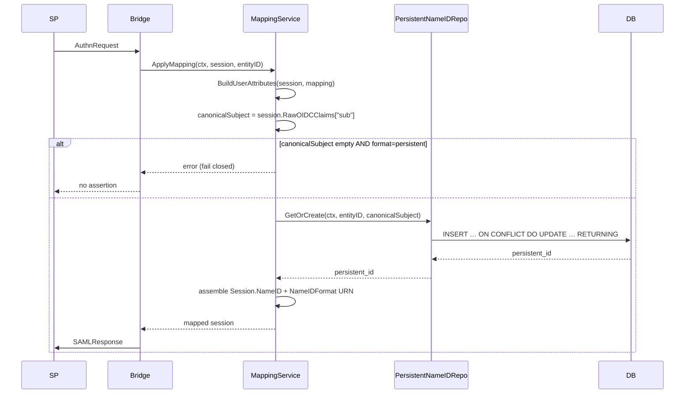

## Context

Phase 1 of per-SP attribute mapping shipped a NameID resolver that
returns the user's mapped `Subject` (or email) for
`nameid_format: persistent`. That value is neither opaque, pairwise,
nor stable under operator reconfiguration of `oidc_claim_mappings`,
which is a SAML 2.0 spec violation and a documented Phase 2 problem
(P1 / FR-3 in
`docs/requirement/per-sp-attribute-mapping-v2-requirements.md`).

Phase 2a (archived as `2026-06-17-attribute-mapping-rich-types`)
introduced `UserAttributes` and `SAMLAttributeDef`, leaving the
NameID resolution path untouched on purpose. That path is what this
change replaces, matching the "Phase 2b" slice of
`docs/design/per-sp-attribute-mapping-v2-design.md`.

The existing implementation surface is small and well-scoped:

- `internal/service/attribute_mapping.go` holds `getNameIDValue`
  and the `ApplyMapping` pipeline.
- `internal/service/interfaces.go` defines `MappingService`.
- `internal/repository/postgres/` already has Postgres-backed
  repositories (`pgxpool.Pool`, tracing-aware) for sessions and
  service providers.
- `internal/app/app.go` wires the mapping service together.
- Goose migrations live in `migrations/00x_*.sql`. The latest
  migration is `002_add_user_name_claims_mapping.sql`, so this
  change adds `003_add_persistent_nameids.sql`.

Stakeholders: SAML SP integrators (need stable pairwise IDs),
operators (need observability and clean rollback), the rest of the
Phase 2 work (Phase 2c/2d/2e all assume this slice is in place).

## Goals / Non-Goals

**Goals:**

- Issue persistent NameIDs that are opaque (RFC 4122 v4 UUID),
  pairwise (unique per `(SP, upstream-user)`), stable across
  authentications, and durable across bridge restarts and DB
  failovers.
- Key the lookup on the upstream-OIDC `sub` claim, not the mapped
  `Subject`, so that operator changes to `oidc_claim_mappings`
  cannot break NameID stability.
- Fail closed when persistent resolution cannot succeed; never
  silently degrade to a non-opaque or unstable value.
- Keep the change scope narrow enough to land as a single PR and
  not entangle Phase 2c (custom assertion maker) or Phase 2d
  (admin API).
- Add observability (structured logs + tracing span) so that
  operators can audit issuance and diagnose failures without
  reading database rows.

**Non-Goals:**

- Removing the existing field-clearing default-attribute
  suppression. That is Phase 2c.
- Adding admin GET/PUT/DELETE endpoints for SP attribute mapping.
  That is Phase 2d.
- Cross-map semantic validation between `oidc_claim_mappings` and
  `saml_attribute_mappings`. Out of scope per the requirement
  document.
- Cleaning up `persistent_nameids` rows for users deleted upstream.
  Explicitly out of scope per
  `docs/requirement/per-sp-attribute-mapping-v2-requirements.md`
  §7 ("Out of Scope") and NFR-6.
- Introducing a Postgres integration test harness if the project
  does not already have one. Coverage stays best-effort within the
  existing harness; a follow-up change can add a real testcontainer
  suite.
- Persisting NameIDs for `transient` or `emailAddress` formats.
  Those continue to be computed at request time.

## Decisions

### D1. Storage shape — dedicated table

```sql
CREATE TABLE IF NOT EXISTS persistent_nameids (
    entity_id     TEXT NOT NULL
        REFERENCES service_providers(entity_id) ON DELETE CASCADE,
    user_subject  TEXT NOT NULL,
    persistent_id TEXT NOT NULL,
    created_at    TIMESTAMPTZ NOT NULL DEFAULT NOW(),
    PRIMARY KEY (entity_id, user_subject)
);
```

**Alternatives considered:**

- **JSONB column on `service_providers`** keyed by user subject.
  Rejected: forces full-row UPDATEs under contention, cannot index
  cleanly, and complicates the cascade story.
- **Single global table keyed by `persistent_id`** with a separate
  `(entity_id, user_subject)` index. Rejected: the natural primary
  key for our access pattern is `(entity_id, user_subject)`. Using
  it as the PK enforces uniqueness for free.
- **Add `user_subject` to `service_providers` rows**. Rejected:
  service providers are 1:N with users; this is a join table.

**Rationale:** the natural PK matches the read/write pattern
(`GetOrCreate(entityID, userSubject)`); the FK with
`ON DELETE CASCADE` satisfies NFR-6 without writing application-side
cleanup code; `created_at` is cheap and aids future debugging.

### D2. Atomic upsert returning the canonical value

```sql
INSERT INTO persistent_nameids (entity_id, user_subject, persistent_id)
VALUES ($1, $2, $3)
ON CONFLICT (entity_id, user_subject) DO UPDATE
    SET entity_id = persistent_nameids.entity_id
RETURNING persistent_id;
```

The `DO UPDATE SET entity_id = persistent_nameids.entity_id` is a
no-op write whose only purpose is to make `RETURNING` fire on both
the insert and the conflict path.

**Alternatives considered:**

- **`SELECT … FOR UPDATE` + `INSERT`**. Rejected: two round-trips,
  and races between the lock and the insert under high concurrency.
- **`INSERT … ON CONFLICT DO NOTHING` + `SELECT`**. Rejected: still
  two round-trips on the conflict path; the no-op `DO UPDATE`
  collapses both paths to a single statement.
- **Application-level mutex per `(entity_id, user_subject)`**.
  Rejected: doesn't survive horizontal scale-out.

**Rationale:** one statement, one round-trip, atomic, race-safe;
this is the canonical Postgres "upsert returning the canonical row"
idiom.

### D3. Lookup key is `RawOIDCClaims["sub"]`, not `UserAttributes.Subject`

The mapping service SHALL extract the canonical subject from
`session.RawOIDCClaims["sub"]` and pass it to `GetOrCreate`. It
SHALL NOT use `UserAttributes.Subject`.

**Why:** OIDC guarantees `sub` is stable per upstream user;
operators can remap `oidc_claim_mappings: {"email": "subject"}` and
break stability if we keyed on the mapped `Subject`. Using the raw
`sub` insulates persistent NameIDs from configuration changes —
this is design decision D7 in the v2 design doc, restated here for
review traceability.

### D4. Fail closed on missing inputs and storage errors

If `RawOIDCClaims["sub"]` is empty/missing/non-string, or the
storage backend returns any error, `ApplyMapping` SHALL return a
typed domain error and the bridge SHALL emit no SAML response.

**Alternatives considered:**

- **Fall back to `attrs.Email` or `attrs.Subject`.** Rejected:
  exposes a non-opaque value (spec violation) and produces a
  different NameID once the DB recovers, breaking stability for the
  SP that already received the fallback.
- **Generate an ephemeral UUID and skip persistence.** Rejected:
  same stability problem — next request would generate a different
  UUID.
- **Cache the most recent successful value per `(SP, user)` in
  memory.** Rejected: cache-miss on bridge restart re-introduces
  the inconsistency this design exists to prevent, and the cache
  itself becomes a stateful component to reason about.

**Rationale:** the SAML 2.0 contract for `persistent` is binary —
either we can issue a stable opaque pairwise value, or we should
not issue an assertion at all. There is no benign fallback.

### D5. Repository is a new, single-method interface

```go
//go:generate mockgen -destination=../../mocks/mock_persistent_nameid_repository.go \
//   -package=mocks . PersistentNameIDRepository

type PersistentNameIDRepository interface {
    GetOrCreate(ctx context.Context, entityID, userSubject string) (string, error)
}
```

**Alternatives considered:**

- **Fold into `ServiceProviderRepository`.** Rejected: violates
  single-responsibility; `service_providers` is 1:N with NameID
  rows.
- **Expose `Get` and `Create` separately.** Rejected: callers
  don't ever want one without the other; exposing two methods
  invites the TOCTOU race that D2 already eliminates.

**Rationale:** the smallest possible surface that satisfies the
spec; one method, one query, easy to mock for service-layer tests.

### D6. UUID generation in the repository, not the service

The repository pre-generates the candidate UUID (with
`github.com/google/uuid`) and includes it in the upsert. The
service never sees it unless it is the value Postgres returned.

**Alternatives considered:**

- **Generate in the service, pass to the repo.** Rejected:
  uselessly couples the service to UUID generation; the repo
  already needs the value to write.
- **Generate in Postgres via `gen_random_uuid()`.** Rejected: adds
  a `pgcrypto` dependency, breaks portability for future SQLite
  test backends, and removes our ability to write deterministic
  unit tests by injecting a UUID generator if we ever need to.

**Rationale:** keeps generation co-located with persistence, which
is also the only place that can validate that the value was the one
ultimately stored.

### D7. Constructor injection over global state for the repository

`MappingService.New` gains a `PersistentNameIDRepository` parameter.
The interface is mocked via `gomock` exactly like the other
repositories in the project.

**Rationale:** matches the project's clean-architecture rule
("services accept interfaces, return concrete structs"); preserves
table-driven testability; consistent with how `ServiceProviderRepository`
is already injected into `MappingService`.

### D8. Observability: structured logs + tracing span

| Site | Level | Keys |
| --- | --- | --- |
| `MappingService.resolveNameID` (format selected) | DEBUG | `entityID`, `format` |
| `MappingService.resolveNameID` (persistent resolved) | INFO | `entityID`, `canonicalSubject` |
| `MappingService.resolveNameID` (failure) | ERROR | `entityID`, `canonicalSubject`, `error` |
| `PersistentNameIDRepo.GetOrCreate` | tracing span `repo.persistent_nameid.get_or_create` | attribute `entityID` |

`canonicalSubject` is logged because it is the OIDC `sub` — the
operator already has access to that value via the IdP and via the
session table, so this does not leak new PII into logs.

**Alternative considered:** logging the issued `persistent_id`.
Rejected: the persistent ID is the SP-facing identifier, and
emitting it to general application logs would let anyone with log
read access correlate users across SPs, defeating pairwise
opacity for log readers.

## Component Interaction



## Data flow notes

- Existing sessions already preserve raw OIDC claims (Phase 1
  feature), so no session-domain changes are required. We do need
  a typed accessor for `RawOIDCClaims["sub"]` that handles the
  `interface{}` JSON shape and returns `("", false)` for
  missing/non-string values. The accessor lives in
  `internal/domain/session.go` so the service layer never deals
  with raw `interface{}` casts.
- `ApplyMapping`'s callers already receive `error` from the
  function. The new error path therefore does not require a
  signature change — only the existing `getNameIDValue` call site
  becomes error-returning.

## Risks / Trade-offs

- **Risk: existing dev/demo SPs lose account linkage on the next
  authentication** → Mitigation: explicit BREAKING note in the
  proposal; pre-production project so production users are
  unaffected; design supports re-linking by having the SP do its
  own first-login provisioning against the new opaque IDs.
- **Risk: `persistent_nameids` grows unbounded as upstream users
  come and go** → Mitigation: each row is ~100 bytes and the table
  is keyed for index-only lookups; storage growth is linear in
  users-times-SPs and is the intended tradeoff for stability.
  Periodic cleanup is intentionally deferred to a future capability.
- **Risk: a long-running outage of the storage backend blocks all
  persistent-format authentications** → Mitigation: this is the
  documented fail-closed behavior, not a bug; operators are alerted
  via the same DB-health monitors that already cover sessions and
  SP records (existing `infrastructure/` health checks).
- **Trade-off: one extra round-trip per persistent-format
  authentication** → Acceptable per NFR-2 ("must not add
  perceptible latency"); the upsert is a single statement against an
  index on the PK, sub-millisecond on the local Postgres in
  practice. Not on the OIDC critical path more than once per auth.
- **Risk: log records contain `canonicalSubject` (OIDC `sub`)** →
  Mitigation: `sub` is already present in session DB rows and IdP
  logs; logging it adds no new exposure surface. Persistent IDs
  themselves are NOT logged.
- **Risk: drift between the v2 design doc, this change's spec, and
  reality** → Mitigation: the spec delta in
  `specs/per-sp-attribute-mapping/spec.md` is the authoritative
  contract for archival; the design doc is a reference, not the
  source of truth.

## Migration Plan

1. **Schema migration** — `migrations/003_add_persistent_nameids.sql`
   creates the table. Goose `Up`/`Down` provided. The migration is
   additive — no existing tables are modified.
2. **Code rollout** — single PR introducing the repository,
   service-layer change, and wiring. No feature flag: the
   `MappingService` constructor's new parameter forces every caller
   in `internal/app/app.go` to be updated atomically.
3. **Operator action** — none required for production (no SPs are
   currently in production). For dev/staging/demo, operators should
   expect persistent NameIDs to change once on rollout, and
   re-provision SP-side accounts if any environment relies on them.
4. **Verification** — run the full suite (`make build fmt lint test
   license-check`); confirm a manual end-to-end flow against a
   sample SP yields the same NameID across two consecutive
   authentications.
5. **Rollback** — revert the code PR and run
   `goose down` to drop the `persistent_nameids` table. SPs that
   already received persistent IDs will revert to the Phase 1
   `attrs.Subject` fallback behavior, which is a regression to the
   pre-change state. Document this caveat in the PR description.

## Open Questions

- Does the existing test suite have any postgres integration
  scaffolding that this change can extend, or is everything
  domain-layer JSON round-trip today? The archived rich-types
  change recorded that the project has no
  `internal/repository/postgres` test suite; if that is still true,
  we will rely on service-layer mocks plus a manual smoke test and
  defer real integration coverage. If it has changed, we should add
  the four storage-layer tests called out in `tasks.md`.
- The current `SAMLSessionAdapter` (or whichever handler invokes
  `ApplyMapping`) needs to surface a domain error to the SAML
  library as a SAML response failure. Confirm the existing error
  path (e.g. `crewjam/saml`'s `Session` adapter contract) does the
  right thing; if not, a small handler-layer adjustment may be
  needed beyond the items listed in `tasks.md`.
