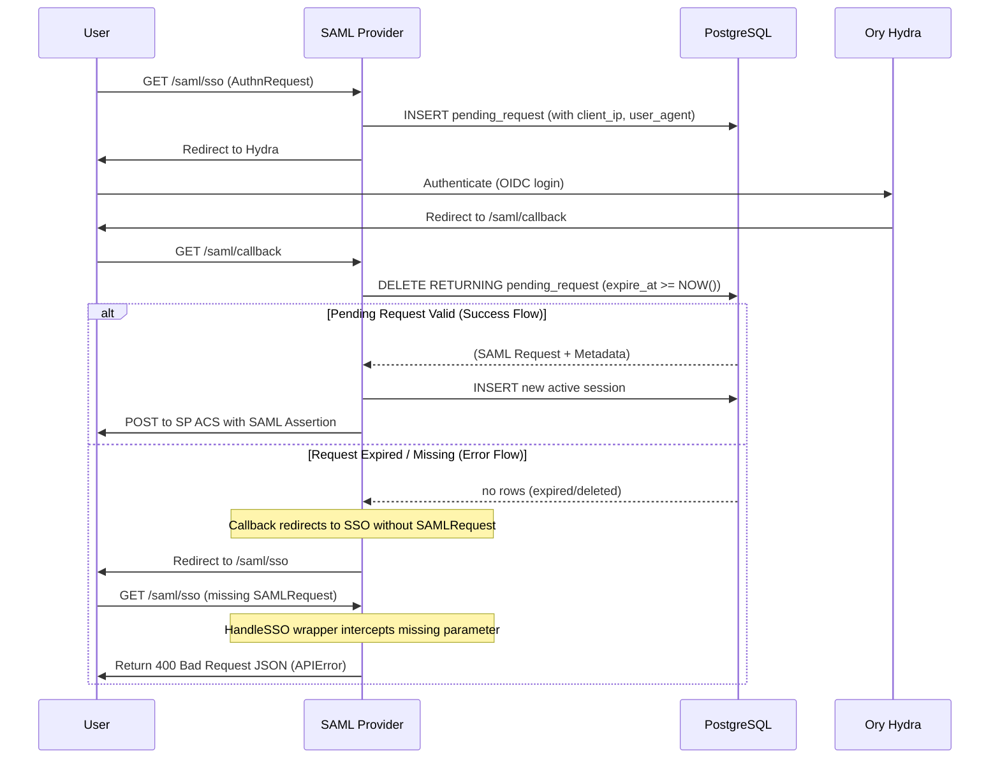

# Design: Persist pending requests

## Context

The Identity SAML Provider currently handles the SAML to OIDC authentication
bridge by storing pending SAML `AuthnRequest` data in an in-memory map. When
the user completes authentication at the OIDC provider (Ory Hydra), they are
redirected back to the `/saml/callback` endpoint, where the application
retrieves the pending request from memory to generate the SAML assertion.

While simple, this state management prevents the application from scaling
horizontally. If multiple replicas exist behind a load balancer, the callback
request may be routed to a pod that did not originate the initial request,
resulting in a failed login. Furthermore, the current implementation lacks
the ability to capture auditing metadata such as the client's IP address and
User-Agent.

## Goals / Non-Goals

**Goals:**

- Eliminate the application's reliance on local memory for SAML login state.
- Enable seamless horizontal scaling (multi-pod deployment).
- Capture and persist client metadata (IP, User-Agent) during the initial
  login step for auditing purposes.
- Maintain atomic state-consumption to prevent replay attacks on the callback
  endpoint.

**Non-Goals:**

- Sharding or horizontally scaling the database itself.
- Implementing Redis or Memcached. A purely PostgreSQL-based approach will
  be used to reduce infrastructure complexity.
- Reading pending requests from database read-replicas. Since the login flow
  is inherently state-mutating, all operations on pending requests will
  execute against the primary database node.

## Decisions

### 1. Persistence Store: PostgreSQL

**Rationale:** We chose to reuse the existing PostgreSQL database rather than
introducing Redis. The application already depends on PostgreSQL for sessions
and service provider configurations. The login volume does not mandate an
ultra-low-latency, in-memory datastore.

**Alternatives Considered:** Redis was considered, which provides
auto-expiring TTLs and avoids table bloat. It was rejected due to the
operational burden of introducing a new infrastructure dependency for
Canonical's deployment environments.

### 2. Extensible Metadata Storage: JSONB

**Rationale:** To satisfy the auditing requirement (Issue #104), we must
store `client_ip` and `user_agent`. Instead of adding discrete columns for
these, we will use a single `client_metadata JSONB` column. This allows us to
capture additional HTTP headers or fingerprinting data in the future without
modifying the database schema.

To ensure the captured `client_ip` is accurate and secure when deployed behind
reverse proxies and cloud load balancers, the application will extract the real
client IP address by inspecting forwarding headers (e.g., `X-Forwarded-For`,
`X-Real-IP`) rather than blindly trusting `r.RemoteAddr`.

**Alternatives Considered:** Dedicated `client_ip` and `user_agent` TEXT
columns. Rejected because tracking requirements evolve frequently, and schema
migrations are operationally expensive compared to appending keys to a JSON
document.

### 3. Atomic State Consumption & Expiration: `DELETE RETURNING`

**Rationale:** We will use PostgreSQL's `DELETE ... RETURNING ...` to
atomically read and delete the pending request in a single query when the
user hits the callback endpoint.

To ensure consistency and security, the retrieval query **must** explicitly
filter by expiration:

```sql
DELETE FROM pending_requests
WHERE request_id = $1 AND expire_at >= NOW()
RETURNING request_id, saml_request, relay_state, client_metadata, created_at, expire_at;
```

- **The Stale Row Problem (Scenario A vs B):** Without this time-based query
  filter, if a user takes longer than the configured TTL to authenticate at
  OIDC, the system's behavior becomes non-deterministic:

  1. If the background `janitor` has already run and pruned the row, the
     callback fails securely (returning `no rows`).
  2. If the background `janitor` has not run yet, the callback would fetch
     the expired row and complete the authentication flow successfully.

- By enforcing `expire_at >= NOW()` at the retrieval query level, the system
  guarantees a deterministic, absolute expiration cutoff. Stale login flows
  will always fail securely on callback, regardless of background janitor
  execution or scheduling latency.

**Alternatives Considered:**

1. **State-Based Soft-Delete (`UPDATE ... SET status = 'consumed'`)**

   - *Concept:* Retain the pending request row permanently and transition its
     `status` from `'pending'` to `'consumed'`.
   - *Pros:* Provides high-fidelity historical database auditing of every
     single login attempt (successful, failed, expired, or replayed) for
     security analytics.
   - *Cons (Security):* Less secure ("fail-open"). Replay protection relies
     entirely on application-level query hygiene (e.g., ensuring `AND status =
     'pending'` is never missing in queries). Any developer query mistake or
     transaction isolation issue could lead to token reuse vulnerabilities.
   - *Cons (Performance/Disk):* SAML `AuthnRequest` XML payloads are large
     (1KB to over 10KB). Soft-deleting millions of transient login attempts
     in a core transactional table causes severe disk bloat and index
     performance degradation, still requiring a secondary permanent pruning
     job.
   - *Decision:* Rejected in favor of physical deletion.

2. **Select-then-Delete in Application Code**

   - *Concept:* Execute a separate `SELECT` statement to fetch the record,
     followed by a `DELETE` statement.
   - *Pros:* Simple to write.
   - *Cons:* Requires wrapping in a transaction with explicit locking
     (`SELECT FOR UPDATE`), adding database latency, transaction lock
     contention, and increasing application logic complexity.
   - *Decision:* Rejected in favor of native single-query atomic `DELETE ...
     RETURNING ...`.

*Decision Trade-off Verdict:* For high-security identity providers, physical
hard deletion of transient secrets is the fail-safe standard. Auditing
requirements are decoupled strictly via:

- **Structured, Immutable Application Logs:** Emitting structured JSON logs
  directly to centralized security pipelines (e.g., Elasticsearch, Splunk)
  upon successful callback completion. This completely isolates transient
  state auditing from core database transactions and avoids requiring an
  additional schema migration on the long-lived `sessions` table.

### 4. Stateless Cleanup & Janitor CLI Design

**Rationale:** To clean up abandoned or stale records without polluting
application server logs or locking core database tables, we introduce a
subcommand-based `janitor` command-line interface.

- **Extensible Command Hierarchy:** We structure the command hierarchically
  under Cobra. The parent `janitor` command registers resource-specific
  subcommands:

  `identity-saml-provider janitor pending-requests [flags]`

  This enables seamless horizontal addition of new cleanup targets (e.g.,
  `janitor sessions`, `janitor persistent-nameids`) in the future without flag
  conflicts.

- **Stateless Cleanup (No TTL Parameter Needed):** Because our database schema
  stores an absolute `expire_at` timestamp computed at request insertion, the
  `janitor pending-requests` command is fully stateless:

  - It does not need a `--ttl` command-line flag or config.
  - It simply deletes records matching `expire_at < NOW()`, avoiding any time
    calculation overhead or configuration mismatch issues at the CLI level.

- **High-Throughput Batching (`--batch-size`):** In high-traffic
  environments, executing a single large `DELETE` on a table with high lock
  contention can cause transaction log exhaustion or severe performance
  degradation. To mitigate this, the cleanup is executed in chunks:

  - Flag: `--batch-size` (default: `1000`)
  - Query Pattern:

    ```sql
    DELETE FROM pending_requests
    WHERE request_id IN (
        SELECT request_id FROM pending_requests
        WHERE expire_at < NOW()
        LIMIT $1
    );
    ```

    The command loops and deletes in batches of size `batch-size` until no more
    stale rows are affected.

- **Output Formatting:** The command supports a `--format` flag (`text` or
  `json`). Output is piped directly to `cmd.OutOrStdout()`, bypassing the
  service's global Zap logger to keep the output clean and standard-compliant.

**Alternatives Considered:**

- **Alternative A: State-based CLI-calculated TTL.** The CLI command receives
  a TTL config or flag, computes `NOW() - TTL`, and passes that cutoff threshold
  to the database cleanup repository. Rejected because it introduces risks of
  configuration drift (e.g., if CLI CronJob and main server use different TTLs)
  and unnecessary client-side time-calculation complexity.
- **Alternative B: In-app background worker.** Execute cleanup inside a
  background goroutine within the web server process. Rejected because it
  increases active application pod memory/CPU footprint, causes lock
  contention if multiple server replicas run cleanups simultaneously, and
  reduces system modularity compared to dedicated Kubernetes CronJobs.

### 5. Intercepting Missing or Expired SAMLRequests at SSO

**Rationale:** When a pending request expires, the callback redirects the
client's browser back to `/saml/sso` without the `SAMLRequest` parameter. The
raw `crewjam/saml` library tries to parse this empty query parameter, failing
with an unexpected EOF decompression error and returning a plain text `400 Bad
Request` page.

Rather than letting the request fail inside the parser, we intercept the request
at `/saml/sso` using an HTTP routing wrapper. If `SAMLRequest` is missing
during a `GET` request, we return a structured JSON API error response using
our standard `WriteJSON` helper.

**Alternatives Considered:**

- **Inlined HTML Error Template:** Render a beautiful inline HTML error page
  explaining how to log in again. Rejected for now to avoid introducing HTML and
  template engine overhead in a purely headless JSON API service.
- **Handling in GetSession:** Intercepting the error in our custom session
  adapter's `GetSession` implementation. Rejected because the library's XML
  parsing occurs *before* `GetSession` is reached, meaning execution never
  reaches our adapter.

## Proposed Architecture & Schema

### 1. Database Schema

We will create a new Goose migration to introduce the `pending_requests`
table:

```sql
CREATE TABLE pending_requests (
    request_id TEXT PRIMARY KEY,
    saml_request TEXT NOT NULL,
    relay_state TEXT,
    client_metadata JSONB DEFAULT '{}'::jsonb,
    created_at TIMESTAMPTZ NOT NULL DEFAULT NOW(),
    expire_at TIMESTAMPTZ NOT NULL
);

-- Crucial for passive expiration checks and efficient background garbage collection
CREATE INDEX idx_pending_requests_expire_at ON pending_requests(expire_at);

-- Optimize for high-churn to trigger aggressive autovacuuming on dead tuples
ALTER TABLE pending_requests SET (
    autovacuum_vacuum_scale_factor = 0.05,
    autovacuum_vacuum_threshold = 100
);
```

### 2. Sequence Flow



## Risks / Trade-offs

- **[Risk] High Table Churn / Bloat** → Because every login results in an
  INSERT and a DELETE within minutes, the `pending_requests` table will
  experience high churn. **Mitigation:** We explicitly configure aggressive
  autovacuum storage parameters on the table directly in the migration script
  (`autovacuum_vacuum_scale_factor = 0.05` and
  `autovacuum_vacuum_threshold = 100`). This forces PostgreSQL to clean up
  dead tuples much more frequently, preventing index and heap bloat.
- **[Risk] Primary Node Load** → All operations for the `pending_requests`
  table must hit the primary writer node. **Mitigation:** Document this
  constraint clearly. Given the typical load profile of enterprise SSO, the
  primary node can easily handle the expected TPS.
- **[Risk] Abandoned Requests Stagnating** → Users often drop out of the
  login flow midway. **Mitigation:** We implement a standalone, subcommand-based
  `janitor` CLI utility (detailed in Decisions section) that periodically runs
  via a Kubernetes CronJob to prune stale records.

## Migration Plan

1. Deploy the new Goose schema migration (`004_add_pending_requests.sql`).
2. Deploy the application update. The application handles the cutover
   transparently, as the `internal/app/app.go` will simply wire the new
   `postgres.NewPendingRequestRepo` instead of the memory repo.
3. No rollback script is strictly required for the data, as pending requests
   are highly transient (15-minute lifespan). If rolled back, users mid-login
   will have to restart the authentication flow.
