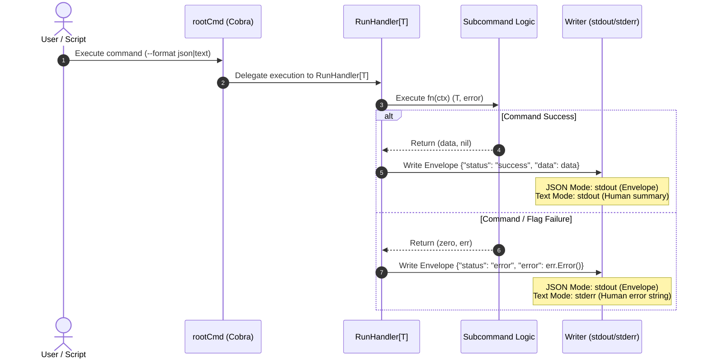

# Design: Standardize CLI formatting

## Context

Currently, `identity-saml-provider` CLI subcommands (`sp`, `janitor`, `migrate`)
independently define persistent format flags, handle error rendering, and
output different JSON structures. See `proposal.md` for motivation and
`specs/cli-formatting/spec.md` for behavioral requirements.

## Goals / Non-Goals

**Goals:**

- Consolidate `--format` flag handling globally at `rootCmd` (providing only
  the long flag `--format` per Canonical CLI standard DE013).
- Implement a generic command runner (`RunHandler[T any]`) that wraps subcommand
  execution, returning `(T, error)` and formatting JSON envelopes automatically.
- Implement a reusable JSON response envelope formatter for success
  (`status: "success", data: T`) and error (`status: "error", error: string`)
  payloads.
- Provide a root Cobra execution wrapper that catches errors and formats them
  into JSON envelopes on `stdout` when `--format json` is active.
- Refactor existing formatters (`sp_formatter.go`, `janitor_formatter.go`,
  `migrate_formatter.go`) to focus on text mode formatting.

**Non-Goals:**

- Modifying underlying domain services or database migration logics.
- Adding complex error code taxonomies to JSON error responses.

## Architecture & Flow



## Decisions

### Decision 1: Root Persistent Flag Registration

- **Choice**: Register `--format` flag globally on `rootCmd` in
  `internal/cmd/root.go` without a short flag alias (`-f`), complying with
  DE013 standards.
- **Rationale**: Eliminates code duplication across subcommand files (`sp.go`,
  `janitor.go`, `migrate.go`) and follows Canonical's single-flag policy.
- **Alternatives Considered**: Subcommand-level flags with shared helper
  function — rejected because flag registration would still need to be repeated
  across every subcommand `init()`.

### Decision 2: Output Stream Allocation

- **Choice**:
  - In JSON mode (`--format json`), write all structured JSON envelopes
    (success and error) to `stdout`.
  - In Text mode (`--format text`), write success payloads to `stdout` and
    error text to `stderr`.
- **Rationale**: Ensures downstream scripts piping `identity-saml-provider
  <cmd> --format json | jq` always receive valid JSON on `stdout`. Isolates
  background logger statements (Zap, DB logs) to `stderr`.
- **Alternatives Considered**: Writing JSON errors to `stderr` in JSON mode —
  rejected because logging contamination on `stderr` breaks `jq` pipelines and
  requires fragile `2>&1` redirections.

### Decision 3: Centralized Error Interceptor

- **Choice**: Wrap Cobra's execution in `rootCmd` or use `PersistentPreRunE` /
  `PersistentPostRunE` and `SilenceErrors: true` in JSON mode.
- **Rationale**: Captures both flag validation errors (e.g. missing required
  flags) and application runtime errors, guaranteeing that unhandled errors are
  formatted cleanly into JSON envelopes.
- **Alternatives Considered**: Having each subcommand handle error formatting
  inside its own `RunE` — rejected because Cobra flag parsing errors happen
  before subcommand `RunE` executes.

### Decision 4: Response Envelope Data Structure

- **Choice**: Define a generic Go envelope struct:

  ```go
  type ResponseEnvelope[T any] struct {
      Status string `json:"status"`
      Data   T      `json:"data,omitempty"`
      Error  string `json:"error,omitempty"`
  }
  ```

- **Rationale**: Simple, zero-dependency data structure that easily serializes
  any subcommand result.
- **Alternatives Considered**: Non-generic `interface{}` envelope — rejected in
  favor of Go 1.18+ generics (`T any`) for type safety.

### Decision 5: Generic Command Runner (`RunHandler[T any]`)

- **Choice**: Implement generic runner
  `RunHandler[T any](cmd, fn func(ctx context.Context) (T, error)) error`.
- **Rationale**: Subcommands return `(T, error)` without writing output or
  calling formatters directly. `RunHandler` formats success into `{"status":
  "success", "data": T}` or error into `{"status": "error", "error":
  err.Error()}` in JSON mode, or renders text output in text mode. Eliminates
  ~80% of CLI boilerplate and guarantees envelope uniformity across all
  commands.
- **Alternatives Considered**: Manual formatter invocation inside each
  subcommand's `RunE` — rejected due to boilerplate duplication and risk of
  divergent error handling.

## Risks / Trade-offs

- **[Risk]** Existing scripts relying on legacy un-enveloped JSON structures
  (e.g., flat `sp add` JSON or raw `janitor` count) will break.
  - *Mitigation*: The change is documented as a standardized CLI enhancement.
    Version release notes will explicitly note the new envelope contract.
- **[Risk]** Goose migration logger emitting text to `stdout` during `migrate`
  commands in JSON mode.
  - *Mitigation*: Continue using `ShouldSilenceGoose()` on formatters to ensure
    Goose output is suppressed when JSON output is active.

## Migration Plan

1. Create generic command runner in `internal/cmd/runner.go` and envelope
   helpers in `internal/cmd/formatter.go`.
2. Move `--format` flag definition to `rootCmd` in `internal/cmd/root.go` and
   implement error interception.
3. Update `sp`, `janitor`, and `migrate` subcommands to use `RunHandler`.
4. Update unit tests in `internal/cmd/*_test.go` to assert new envelope
   structure and stream behavior.
