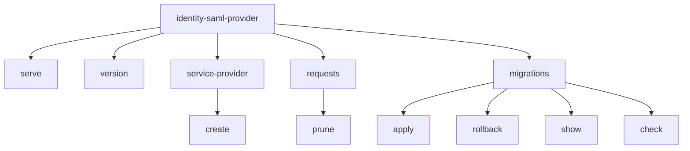

## Context

The Identity SAML Provider CLI commands live in `internal/cmd/`. Currently, command subtrees use names (`sp add`, `janitor pending-requests`, `migrate up/down/status/check`) and formatting patterns that diverge from Canonical CLI Standards (DE013). See `proposal.md` for motivation and background.

## Goals / Non-Goals

**Goals:**
- Refactor Cobra command definitions in `internal/cmd/*.go` to enforce DE013 command grammar and flag guidelines.
- Update tabular output formatters to omit ASCII decorations, use uppercase headers, 2-space separators, and support `--no-headers`.
- Standardize error output formatting to `error: <message>` and direct phrasing without contractions.

**Non-Goals:**
- Modifying underlying service, repository, or domain business logic.
- Maintaining legacy command aliases unless required by future deprecation policies.

## Decisions

### Decision 1: Command Structure & Hierarchy (`internal/cmd/`)

- **Choice**: Structure CLI commands under domain noun groups (`service-provider`, `requests`, `migrations`) with explicit action verbs (`create`, `prune`, `apply`, `rollback`, `show`, `check`).
- **Rationale**: Fulfills DE013's core requirement that commands must be action verbs ("Commands are verbs"), organized using our project preference for domain noun groups (`<noun> <verb>`).
- **Alternatives Considered**:
  - *Flat commands (`create-sp`, `prune-pending-requests`)*: Rejected because domain grouping keeps multi-operation areas cleanly categorized as the tool grows.
  - *Command structure `janitor pending-requests`*: Rejected because combining the noun group `janitor` with the noun phrase `pending-requests` lacks an action verb, violating DE013 verb rules.

### Decision 2: Elimination of Short Flags on Subcommands

- **Choice**: Remove `-e`, `-a`, and `-b` short flags from `service-provider create`. Only retain `--entity-id`, `--acs-url`, `--acs-binding`, and `--attribute-mapping-file`.
- **Rationale**: DE013 states "do not offer both short and long flags for the same action". Long flags are self-documenting and less ambiguous for admin tooling.
- **Alternatives Considered**:
  - *Keeping `-e` and `-a`*: Violates DE013 dual flag policy.

### Decision 3: DE013 Tabular Output Formatting

- **Choice**: Update `formatMigrationStatuses` in `internal/cmd/migrate_formatter.go` (and rename formatting functions to match `migrations show`).
  - Output header: `APPLIED AT            MIGRATION`
  - Separator: 2 spaces.
  - Omit ASCII lines (`====`) and dashes (`--`).
  - Add `--no-headers` boolean flag on `migrations show`.
- **Rationale**: Directly satisfies DE013 Tabular Data requirements.

### Decision 4: Standardized Error Phrasing

- **Choice**: In `internal/cmd/runner.go` and error handlers, replace `Error: %v` with `error: %v` and ensure error messages use "cannot ..." instead of "failed to ...".
- **Rationale**: Aligns with Canonical copy guidelines (DE013 § CLI Copy and Tone of Voice).

## Risks / Trade-offs

- **[Risk] Breaking changes for existing automated deployment/test scripts** $\rightarrow$ **Mitigation**: Update all internal tests, skaffold/compose scripts, and documentation to use the new command names (`service-provider create`, `requests prune`, `migrations apply`).

## Migration Plan

1. Update command initializations and Cobra definitions in `internal/cmd/*.go`.
2. Update unit tests in `internal/cmd/*_test.go`.
3. Update any Makefile targets, scripts, or Docker compose references calling legacy commands.
4. Run full verification suite (`make build`, `make fmt`, `make lint`, `make test`, `make license-check`).
