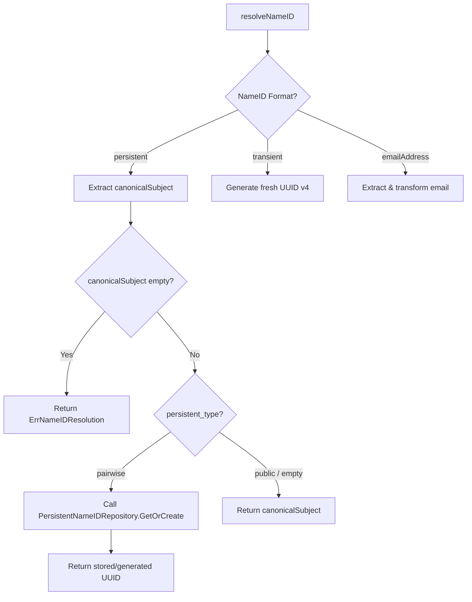

# Design: Configurable Persistent NameID Mode (Public Default vs Pairwise)

## Context

See `proposal.md` for motivation. Previously, `resolveNameID` in
`internal/service/attribute_mapping.go` handled `nameid_format: "persistent"`
by unconditionally invoking
`PersistentNameIDRepository.GetOrCreate(ctx, entityID, canonicalSubject)`,
which generated/retrieved an RFC 4122 v4 UUID from the `persistent_nameids`
Postgres table.

To align with standard OpenID Connect subject identifier types (`public` vs `pairwise`),
the bridge defaults `nameid_format: "persistent"` to `"public"` mode (emitting the
canonical OIDC `sub` directly), while allowing explicit opt-in to `"pairwise"` mode.

## Goals / Non-Goals

**Goals:**

- Add `persistent_type` field to `AttributeMapping` supporting `"public"`
  (default) and `"pairwise"`.
- Bypass `PersistentNameIDRepository` lookups entirely when `persistent_type` is
  `"public"` or omitted/empty.
- Ensure structural validation in `AttributeMapping.Validate()` checks
  `persistent_type` (valid values: `"public"` or `"pairwise"`; rejected if
  `nameid_format` is non-persistent).

**Non-Goals:**

- Schema changes to the `persistent_nameids` table.
- Automatic migration or backfilling of existing persistent NameIDs.

## Decisions

### 1. `persistent_type` Placement & Default Behavior

**Choice:** Add `PersistentType string` (`json:"persistent_type,omitempty"`)
as a top-level field on `AttributeMapping` in
`internal/domain/attribute_mapping.go`. Default to `"public"` when empty.

**Rationale:** `persistent_type` configures how `nameid_format` is interpreted,
making it logically parallel to `nameid_format`. Defaulting empty string to `"public"`
conforms with OIDC subject type vocabulary and ensures persistent NameIDs directly
carry the upstream subject identifier unless `"pairwise"` is explicitly specified.

### 2. Resolution Control Flow in `resolveNameID`

### 3. Structural Validation

In `AttributeMapping.Validate()` (`internal/domain/attribute_mapping.go`):

- If `persistent_type` is non-empty, verify it is one of `"public"` or
  `"pairwise"`.
- If `persistent_type` is non-empty and `nameid_format` is explicitly set to a
  non-persistent format (e.g. `"transient"` or `"emailAddress"`), return
  `ValidationError` with field `persistent_type`.
- If invalid, return `ValidationError` with field `persistent_type`.

### 4. Database Schema & Admin Handlers Impact

- **Database**: No DB migration is necessary. `service_providers.attribute_mapping`
  is stored as `JSONB`, which dynamically accommodates the new `persistent_type`
  top-level field.
- **Handlers**: `HandleUpdateAttributeMapping` in `internal/handler/admin.go`
  unmarshals JSON request bodies directly into `domain.AttributeMapping`. Adding
  the struct field tag `json:"persistent_type,omitempty"` to
  `domain.AttributeMapping` automatically handles API request/response JSON
  serialization without needing separate DTO structs.

## Risks / Trade-offs

- **Breaking Change for Existing Persistent SPs:**
  - *Risk:* SPs configured with `nameid_format: "persistent"` that relied on
    pairwise UUID generation will now receive raw OIDC `sub` values upon upgrade
    unless explicitly updated to `persistent_type: "pairwise"`.
  - *Mitigation:* Document the breaking change in release notes and provide
    guidance on setting `persistent_type: "pairwise"` for SPs requiring per-SP UUIDs.

- **Missing `sub` Claim in Public Mode:**
  - *Risk:* If upstream OIDC provider fails to return `sub`,
    `session.CanonicalSubject()` is empty.
  - *Mitigation:* Existing fail-closed behavior returns
    `ErrNameIDResolution` and aborts SAML assertion generation in both
    `public` and `pairwise` modes.
