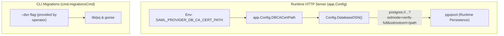

## Context

See `proposal.md` for motivation.

The application uses `pgxpool` (`github.com/jackc/pgx/v5/pgxpool`) for runtime database persistence and `github.com/lib/pq` with Goose for database migrations. Currently, `app.Config` builds the PostgreSQL connection DSN for runtime connections with `sslmode` specified in `DBSSLMode` (defaulting to `disable`). Both `pgx` and `lib/pq` natively support the `sslrootcert` parameter in standard PostgreSQL DSN connection strings.

> **Note on Migrations**: CLI migration subcommands (`migrations apply`, `migrations check`, etc.) do not read application environment variables or call `Config.DatabaseDSN()`; they accept a complete PostgreSQL connection string directly via the `--dsn` flag. Because `github.com/lib/pq` already natively parses standard parameters like `sslrootcert` and `sslmode`, no code changes are required in the migration CLI commands.

## Goals / Non-Goals

**Goals:**
- Add `DBCACertPath` (`SAML_PROVIDER_DB_CA_CERT_PATH`) to `app.Config`.
- Include `sslrootcert` in `DatabaseDSN()` query string when `DBCACertPath` is non-empty for runtime connections.
- Default `sslmode` to `verify-full` (secure-by-default) when `DBCACertPath` is provided and `DBSSLMode` is not explicitly configured.
- Ensure full compatibility with `pgxpool` connection parsing under `verify-full`, `verify-ca`, and other standard SSL modes.

**Non-Goals:**
- Modifying CLI migration commands (they already accept raw DSNs via `--dsn` and delegate parsing to `lib/pq`).
- Manual in-memory TLS certificate parsing or injecting custom `tls.Config` into `pgxpool` directly (using the standard PostgreSQL DSN parameter `sslrootcert` leverages native driver support).
- Database schema changes (no migrations required).

## Decisions

### Decision 1: Use Standard `sslrootcert` Query Parameter in `DatabaseDSN()`

- **Rationale**: `pgx` (`pgconn`) natively understands `sslrootcert=<path>` and `sslmode=<mode>` in connection strings. Appending `sslrootcert` into the query string generated by `DatabaseDSN()` enables CA verification for the runtime connection pool in a clean, standard way without requiring custom connection wrappers.
- **Alternatives Considered**:
  - *Custom TLS config injection in pgxpool*: Would require configuring `pgxpool.Config.ConnConfig.TLSConfig` manually instead of relying on standard DSN parsing.
  - *Setting global system trust store*: Modifying system-wide trust stores in containers is invasive and prevents per-service certificate scoping.

### Decision 2: Default to `verify-full` when `DBCACertPath` is Provided

- **Rationale**: In standalone application design, providing a custom CA root certificate implies full TLS validation. Following industry security standards (and PostgreSQL's strongest TLS verification level), defaulting to `verify-full` ensures both certificate signature verification and hostname verification against MITM attacks. If an orchestrator, operator, or administrator specifically needs CA verification without hostname verification (e.g. in environments with dynamic internal hostnames), they can explicitly configure `SAML_PROVIDER_DB_SSLMODE=verify-ca`.
- **Alternatives Considered**:
  - *Default to `verify-ca`*: Omits hostname checking by default; better suited as an explicit operational choice by orchestrators (such as Juju charms) rather than the application's default.
  - *Keep `disable`*: Ineffective and semantically broken when a CA certificate path is explicitly provided.

## Security, Performance, and Observability

- **Security**: In `verify-full` mode (default when CA cert path is provided), `pgxpool` validates that the PostgreSQL server certificate was signed by the configured CA and that the server hostname matches the certificate's SAN/CN. In `verify-ca` mode, hostname matching is skipped.
- **Performance**: Zero overhead outside of standard TLS handshake latency when TLS is enabled.
- **Observability**: Connection errors during pool initialization or ping report standard PostgreSQL TLS handshake errors directly.
- **Migrations**: No database schema migrations are required for this change.

## Risks / Trade-offs

- **[Risk]** Certificate file path does not exist on disk when `DBCACertPath` is set.
  → **Mitigation**: Database connection ping fails fast on startup with a descriptive connection error from pgx.
- **[Risk]** Special characters in certificate file path.
  → **Mitigation**: `url.Values.Encode()` in `DatabaseDSN()` safely URL-encodes the `sslrootcert` value.
